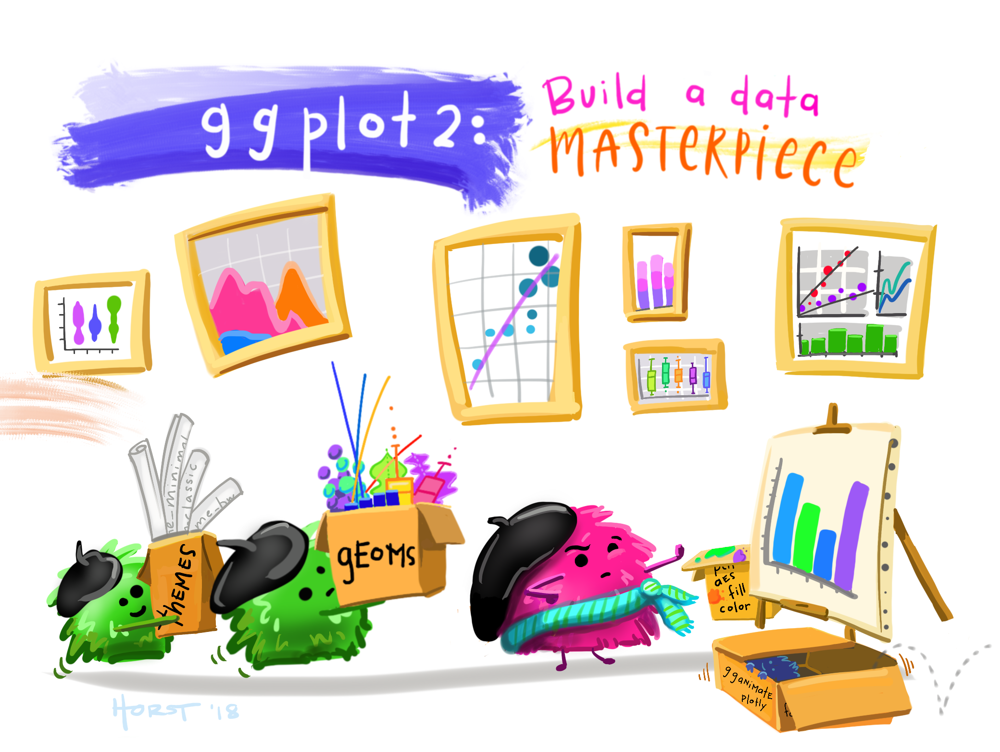
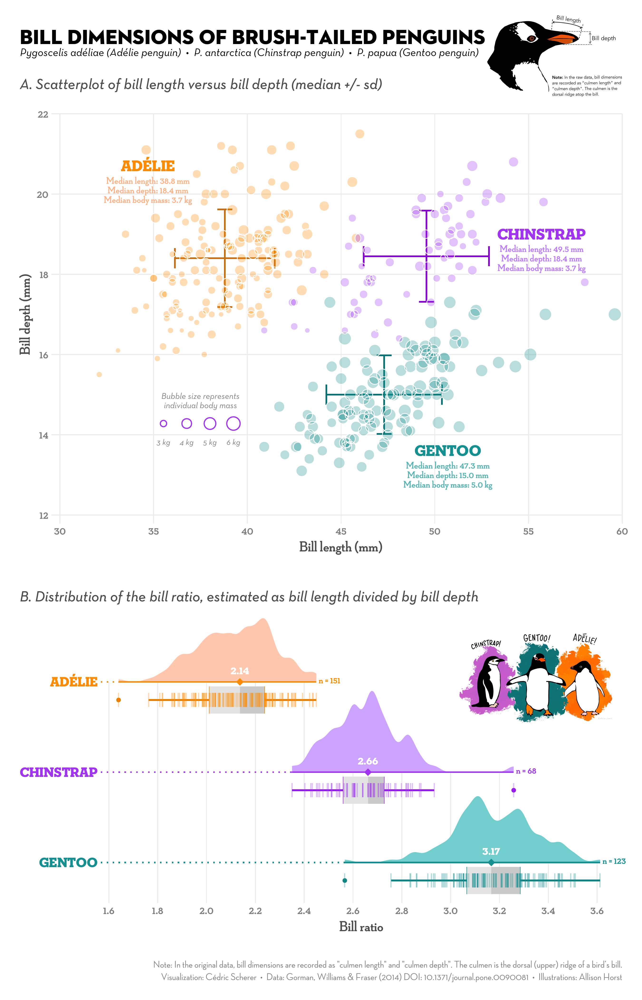
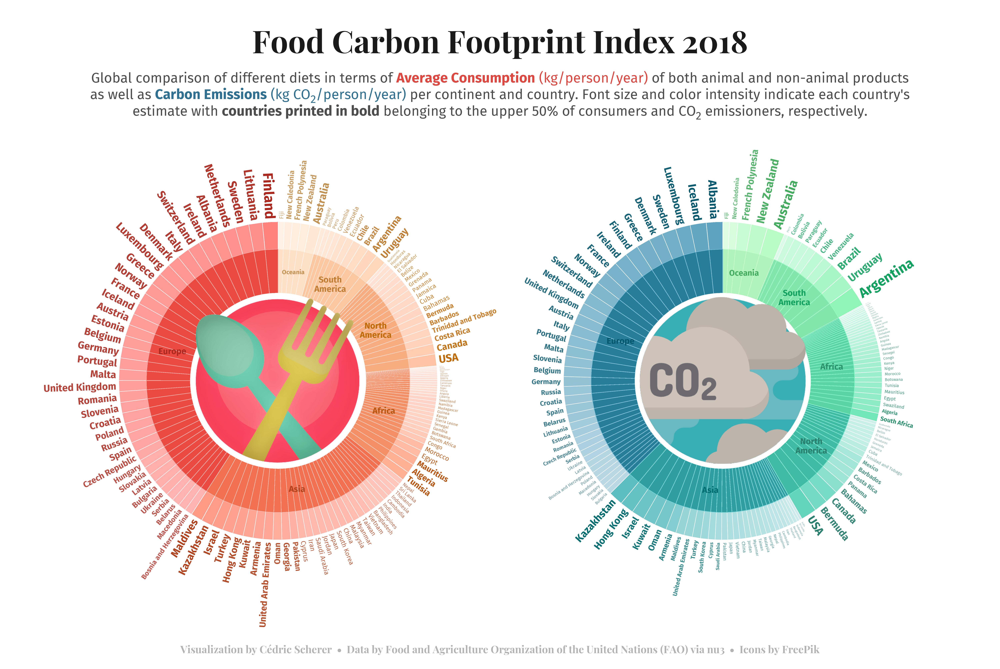
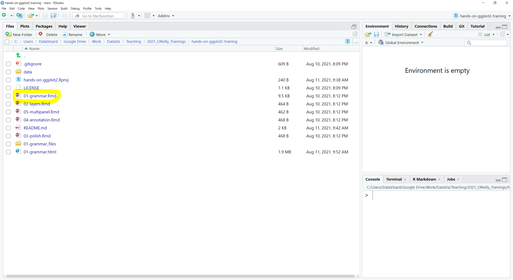

class: inverse, center
background-image: url("img/darklight_RichardStrozynski.jpg")
background-size: contain

```{r options, include = FALSE, purl=FALSE}
hook_source <- knitr::knit_hooks$get('source')
knitr::knit_hooks$set(source = function(x, options) {
  x <- stringr::str_replace(x, "^[[:blank:]]?([^*].+?)[[:blank:]]*#<<[[:blank:]]*$", "*\\1")
  hook_source(x, options)
})

knitr::opts_chunk$set(
  echo = TRUE, 
  warning = FALSE, 
  message = FALSE, 
  collapse = TRUE,
  fig.height = 6.3,
  fig.allign = 'center',
  fig.retina = 2,
  dev = "ragg_png", 
  res = 1000
)

Sys.setlocale("LC_TIME", "C")

options(width = 80)
```

<br><br>
# Hands–On Data Visualization with <code style='color:#ebc500;'>ggplot2</code><br><b style='font-size:25pt;color:#a7a7a7;'>Segment 1: The Grammar of Graphics</b>
<br><br><br><br><br><br><br>
#### Dr. Cédric Scherer<b style='color:#ccba56;font-weight:400;line-height:150%;'><br>Pearson Live Training Session for O'Reilly<br>September 3, 2021</b><br>

```{r prep, echo=FALSE, purl=FALSE}
library(tidyverse)
library(conflicted)
filter <- dplyr::filter
theme_set(theme_grey(base_size = 15, base_family = "Roboto Condensed"))
```

---
background-image: url("img/portfolio/Cards.png")
background-position: center
background-size: contain

---
class: center
background-image: url("img/rtidy2.png")
background-size: contain

---
class: inverse, center

### Data Visualizations for Scientific Publications & Talks

.pull-left[
<p style='text-align:center;'><br><capinv>Scherer et al. 2019 Journal of Animal Ecology</capinv></p>
]

.pull-right[
<p style='text-align:center;'><br><capinv>Scherer et al. 2020 Oikos</capinv></p>
<p style='text-align:center;'><br><capinv>Sciaini et al. 2019 Methods in Ecology & Evolution</capinv></p>
]

---
class: inverse, center

### Data Visualizations for Client Projects

</img>

</img>

</img>

</img>

</img>

</img>

---
class: inverse, center

### Data Visualizations as Personal Projects

</img>

</img>

</img>

</img>

</img>

---
class: inverse, center
exclude: true

#### cedricscherer.com

<p style='text-align:center;'><br><b style='color:lightgrey;font-size:12pt;'>cedricscherer.netlify.com</b></p>

---
class: inverse, center
exclude: true

.pull-left[
<p style='text-align:center;'></p>
]

.pull-right[
<p style='text-align:center;'></p>
]

---
class: inverse, center
exclude: true

#### github.com/z3tt

<p style='text-align:center;'><br><b style='color:lightgrey;font-size:12pt;'>github.com/z3tt</b>

---
class: center, inverse

<br>
<p style="text-align:center;">
<br><br>

<b style='font-size:28pt;'><code style='color:#ebc500;'>ggplot2</code> is a system for declaratively creating graphics,<br>based on "The Grammar of Graphics" (Wilkinson, 2005).</b>

--

<br>
<span style='font-size:22pt;'>You provide the data, tell <code style='color:#ebc500;font-weight:700;'>ggplot2</code> how to <b>map variables to aesthetics</b>,<br>what graphical primitives to use, and it takes care of the details.</span><br>
<br>
<i style='font-size:12pt;color:grey;'>ggplot2 package description</i>

---
<br><br>

# Advantages of `ggplot2`

<ul style='font-size:22pt;color:#28a87d;font-weight:700;margin: 50px 50px;'>
<li>consistent underlying grammar of graphics (Wilkinson, 2005)</li>
</ul>

---
<br><br>

# Advantages of `ggplot2`

<ul style='font-size:22pt;color:#28a87d;font-weight:700;margin: 50px 50px;'>
<li>consistent underlying grammar of graphics (Wilkinson, 2005)</li>
<br>
<li>very flexible, layered plot specification</li> 
</ul>

---
<br><br>

# Advantages of `ggplot2`

<ul style='font-size:22pt;color:#28a87d;font-weight:700;margin: 50px 50px;'>
<li>consistent underlying grammar of graphics (Wilkinson, 2005)</li>
<br>
<li>very flexible, layered plot specification</li> 
<br>
<li>theme system for polishing plot appearance</li>
</ul>

---
<br><br>

# Advantages of `ggplot2`

<ul style='font-size:22pt;color:#28a87d;font-weight:700;margin: 50px 50px;'>
<li>consistent underlying grammar of graphics (Wilkinson, 2005)</li>
<br>
<li>very flexible, layered plot specification</li> 
<br>
<li>theme system for polishing plot appearance</li>
<br>  
<li>active and helpful community</li>
</ul>

---
class: center, middle

<br><cap>Illustration by Allison Horst</cap>

---
class: center, middle

<p style='text-align:center;'><br><cap>Source: Rstudio (ggplot2.tidyverse.org)</cap></p>

---
class: center, middle

<br><cap>Illustration by Allison Horst</cap>

---
class: inverse, center, middle

# <b style='font-size:70pt;'>The <code style='color:#ebc500;'>ggplot2</code> Showcase</b><br><br>

---
class: inverse, center, middle

<p style='text-align:center;'><br><capinv>Collection of BBC Graphics<br><span style='color:grey;font-size:8pt;'>(modified from bbc.github.io/rcookbook)</span></capinv></p>

---
class: inverse, center, middle

<p style='text-align:center;'><br><capinv>Collection of BBC Graphics<br><span style='color:grey;font-size:8pt;'>(modified from bbc.github.io/rcookbook)</span></capinv></p>

---
class: inverse, center, middle

<p style='text-align:center;'>
<br><capinv>Reworked OurWorldInData Graph</capinv></p>

---
class: inverse, center, middle

<p style='text-align:center;'>
<br><capinv>Contribution to #TidyTuesday 2020/31</capinv></p>

---
class: inverse, center, middle

<p style='text-align:center;'>
<br><capinv>Contribution to #30DayChartChallenge 2021</capinv></p>

---
class: inverse, center, middle

<p style='text-align:center;'><br><capinv>European Elections by Torsten Sprenger<br><span style='color:grey;font-size:8pt;'>(twitter.com/spren9er/status/1138000009306234880)</span></capinv></p>

---
class: inverse, center, middle

<p style='text-align:center;'>
<br><capinv>Contribution to #TidyTuesday</capinv></p>

---
class: inverse, center, middle
exclude: true

<p style='text-align:center;'>
<br><capinv>Contribution to #SWDchallenge</capinv></p>

---
class: inverse, center, middle

<p style='text-align:center;'><br><capinv>Contribution to #SWDchallenge</capinv></p>

---
class: inverse, center, middle
exclude: true

<p style='text-align:center;'><br><capinv>Personal Project "The Worst Days So Far"</capinv></p>

---
class: inverse, center, middle

<p style='text-align:center;'><br><capinv>#TidyTuesday Contribution by Jack Davison<br><span style='color:grey;font-size:8pt;'>(github.com/jack-davison/tidytuesday)</span></capinv></p>

---
class: inverse, center, middle

<p style='text-align:center;'><br><capinv>Contribution to the BES MoveMap Contest</capinv></p>

---
class: inverse, center, middle

<p style='text-align:center;'><br><capinv>Bivariate Choropleth Map by Timo Gossenbacher<br><span style='color:grey;font-size:8pt;'>(timogrossenbacher.ch/2019/04/bivariate-maps-with-ggplot2-and-sf)</span></capinv></p>

---
class: inverse, center, middle

.pull-left[
<p style='text-align:center;'><br><capinv>Example of the {gganimate} Package<br><span style='color:grey;font-size:8pt;'>(github.com/thomasp85/gganimate/wiki)</span></capinv></p>
]

.pull-right[
<p style='text-align:center;'><br><capinv>Personal Project</capinv></p>
]

---
class: inverse, center, middle

<p style='text-align:center;'><br><capinv>Generative art by Thomas Lin Pedersen<br></capinv></p>

---
class: inverse, center, middle

# <b style='font-size:70pt;color:#ebc500;'>The Setup</b><br><br>

---

## The Course Material

* **Clone the <a href="https://github.com/z3tt/hands-on-ggplot2-training">repository</a>**

<p style='text-align:center;'>

---

## The Course Material

* Clone the <a href="https://github.com/z3tt/hands-on-ggplot2-training">repository</a>.
* **Open the R Project: `hands-on-ggplot2.Rproj`**

<p style='text-align:center;'>

---

## The Course Material

* Clone the <a href="https://github.com/z3tt/hands-on-ggplot2-training">repository</a>.
* Open the R Project: `hands-on-ggplot2.Rproj`
* **Open the first script: `01-grammar.Rmd`**

<p style='text-align:center;'>

---

## The Course Material

* Clone the <a href="https://github.com/z3tt/hands-on-ggplot2-training">repository</a>.
* Open the R Project: `hands-on-ggplot2.Rproj`
* Open the first script: `01-grammar.Rmd`
* **Run code locally**

<p style='text-align:center;'>

---

## The Course Material

* Clone the <a href="https://github.com/z3tt/hands-on-ggplot2-training">repository</a>.
* Open the R Project: `hands-on-ggplot2.Rproj`
* Open the first script: `01-grammar.Rmd`
* Run code locally or **knit the report**

<p style='text-align:center;'>

---

## The Course Material

* Clone the <a href="https://github.com/z3tt/hands-on-ggplot2-training">repository</a>.
* Open the R Project: `hands-on-ggplot2.Rproj`
* Open the first script: `01-grammar.Rmd`
* Run code locally or **knit the report**

<p style='text-align:center;'>

---
background-image: url("img/bg-poll.png")
background-size: cover

## POLL: Do you use Rmarkdown reports?


<ul style='font-size:26pt;margin: 50px 50px;'>
<li style='margin-bottom: 15px;'>No, never heard of it.</li>
<li style='margin-bottom: 15px;'>No, but I am aware they exist.</li>
<li style='margin-bottom: 15px;'>Yes, rarely.</li>
<li style='margin-bottom: 15px;'>Yes, extensively.</li>
</ul>

---

## The Package

<span style='font-size:16pt;'>`ggplot2` is a **data visualization package** for the programming language `R` created by Hadley Wickham.</span>

```{r ggplot-package, eval=FALSE}
install.packages("ggplot2")
library(ggplot2)
```

--

<span style='font-size:16pt;'>`ggplot2` is part of the [`tidyverse`](https://blog.rstudio.org/2016/09/15/tidyverse-1-0-0/), a set of packages to manipulate and explore data.</span>

```{r tidyverse-package, eval=FALSE}
install.packages("tidyverse")
library(tidyverse)
```

<p style="text-align:right;"><font color="grey" size=2><i>Source: dicook.org/files/rstudio/#3</i></font></p>

---

## The Data Set

We use **cryptocurrency financial data**, pulled from [CoinMarketCap.com](https://www.kaggle.com/philmohun/cryptocurrency-financial-data).<br>

<p style='text-align:left;'>

---

We limit the data to the period 08/2017–12/2019 and the top 4 cryptocurrencies:


---
background-image: url("img/bg-poll.png")
background-size: cover

## POLL: Are you into cryptocurrencies?

<ul style='font-size:26pt;margin: 50px 50px;'>
<li style='margin-bottom: 15px;'> No, I don't care.</li>
<li style='margin-bottom: 15px;'>Yes, I'm keeping an eye on that new technology (passively).</li>
<li style='margin-bottom: 15px;'>Yes, I am part of the movement.</li>
</ul>

---
class: inverse, center, middle

# <b style='font-size:70pt;color:#ebc500;'>Import the Data</b><br><br>

---

## Import the Data

Using the `read_csv()` function form the `{readr}` package, we can read the data directly from the web:

```{r data-readr}
url <- "https://raw.githubusercontent.com/z3tt/hands-on-ggplot2/main/data/crypto_cleaned.csv"

data <- readr::read_csv(url)
```

---

## Short Explanation of `::`

<br>The so–called **namespace** allows to access functions from a package directly without loading it first.

<code style='font-size:30pt;'>packagename::function(argument)</code>

--

<br>Furthermore, it helps readers to understand from which package a function is imported from.

---

## Import the Data

Using the `read_csv()` function form the `{readr}` package, we can read the data directly from the web:

```{r data-readr-inspect}
url <- "https://raw.githubusercontent.com/z3tt/hands-on-ggplot2/main/data/crypto_cleaned.csv"

data <- readr::read_csv(url)

data #<<
```

---

## Import the Data

Of course, one can import local files as well:

```{r data-readr-local}
data_local <- readr::read_csv("data/crypto_cleaned.csv")

data_local
```

--

This assumes that you have placed the file in a folder called `data` in your working directory.  
You can specify this directory via `setwd()` or, and preferably, use R projects.

---
background-image: url("img/bg-exercise.png")
background-size: cover

## Exercise 1:

* Import the data set on Chicago weather data:<br>https://raw.githubusercontent.com/z3tt/ggplot-courses/master/data/chicago-nmmaps.csv
  
* Inspect the data.

---

## Exercise 1: Import the Data

```{r import-chic}
chic <- readr::read_csv(
  "https://raw.githubusercontent.com/z3tt/ggplot-courses/master/data/chicago-nmmaps.csv"
)

# chic <- readr::read_csv("data/chicago-nmmaps.csv")
```

---

## Exercise 1: Inspect the Data

```{r inspect-chic-1}
tibble::glimpse(chic)
```

---

## Exercise 1: Inspect the Data

```{r inspect-chic-2}
summary(chic)
```

---

## Exercise 1: Inspect the Data

```{r inspect-chic-3}
range(chic$date)

range(chic$temp)

unique(chic$season)

unique(chic$year)
```

---
class: inverse, center, middle

# <b style='font-size:70pt;'>The Structure of<br><code style='color:#ebc500;'>ggplot2</code></b><br><br>
# <span style='font-size:40pt;color:#a7a7a7;'>"The Grammar of Graphics"</span><br><br>

---

## The Structure of `ggplot2`

<br>
<table style='width:100%;font-size:15pt;font-family:DM Sans;'>
  <tr>
    <th>Layer</th>
    <th>Function</th>
    <th>Explanation</th>
  </tr>
  <tr>
    <td><b style='color:#67676;'>Data</b></td>
    <td><code>ggplot(data)</code></td>
    <td>The raw data that you want to visualise.</td>
  </tr>
  <tr>
    <td><b style='color:#67676;'>Aesthetics&emsp;&emsp;&emsp;&emsp;&emsp;</b></td>
    <td><code>aes()</code></td>
    <td>Aesthetic mappings of the geometric and statistical objects.</td>
  </tr>
  <tr>
    <td><b style='color:#67676;'>Layers</b></td>
    <td><code>geom_*()</code> and&nbsp;&nbsp;<code>stat_*()</code></td>
    <td>The geometric shapes and statistical summaries representing the data.</td>
  </tr>
</table>

---

## The Structure of `ggplot2`

<br>
<table style='width:100%;font-size:15pt;font-family:DM Sans;'>
  <tr>
    <th>Layer</th>
    <th>Function</th>
    <th>Explanation</th>
  </tr>
  <tr>
    <td><b style='color:#67676;'>Data</b></td>
    <td><code>ggplot(data)</code></td>
    <td>The raw data that you want to visualise.</td>
  </tr>
  <tr>
    <td><b style='color:#67676;'>Aesthetics&emsp;&emsp;&emsp;&emsp;&emsp;</b></td>
    <td><code>aes()</code></td>
    <td>Aesthetic mappings of the geometric and statistical objects.</td>
  <tr>
    <td><b style='color:#67676;'>Layers</b></td>
    <td><code>geom_*()</code> and&nbsp;&nbsp;<code>stat_*()</code></td>
    <td>The geometric shapes and statistical summaries representing the data.</td>
  </tr>
  <tr>
    <td><b style='color:#67676;'>Scales</b></td>
    <td><code>scale_*()</code></td>
    <td>Maps between the data and the aesthetic dimensions.</td>
  </tr>
  <tr>
    <td><b style='color:#67676;'>Coordinate System</b></td>
    <td><code>coord_*()</code></td>
    <td>Maps data into the plane of the data rectangle.</td>
  </tr>
  <tr>
    <td><b style='color:#67676;'>Facets</b></td>
    <td><code>facet_*()</code></td>
    <td>The arrangement of the data into a grid of plots.</td>
  </tr>
  <tr>
    <td><b style='color:#67676;'>Visual Themes</b></td>
    <td><code>theme()</code> and&nbsp;&nbsp;<code>theme_*()</code></td>
    <td>The overall visual defaults of a plot.</td>
  </tr>
</table>

---

## The Structure of `ggplot2`

<br>
<table style='width:100%;font-size:15pt;font-family:DM Sans;'>
  <tr>
    <th>Layer</th>
    <th>Function</th>
    <th>Explanation</th>
  </tr>
  <tr>
    <td><b style='color:#67676;'>Data</b></td>
    <td><code>ggplot(data)</code></td>
    <td>The raw data that you want to visualise.</td>
  </tr>
  <tr>
    <td><b style='color:#67676;'>Aesthetics&emsp;&emsp;&emsp;&emsp;&emsp;</b></td>
    <td><code>aes()</code></td>
    <td>Aesthetic mappings of the geometric and statistical objects.</td>
  </tr>
  <tr>
    <td><b style='color:#67676;'>Layers</b></td>
    <td><code>geom_*()</code> and&nbsp;&nbsp;<code>stat_*()</code></td>
    <td>The geometric shapes and statistical summaries representing the data.</td>
  </tr>
  <tr>
    <td><b style='color:#67676;'>Scales</b></td>
    <td><code>scale_*()</code></td>
    <td>Maps between the data and the aesthetic dimensions.</td>
  </tr>
  <tr>
    <td><b style='color:#67676;'>Coordinate System</b></td>
    <td><code>coord_*()</code></td>
    <td>Maps data into the plane of the data rectangle.</td>
  </tr>
  <tr>
    <td><b style='color:#67676;'>Facets</b></td>
    <td><code>facet_*()</code></td>
    <td>The arrangement of the data into a grid of plots.</td>
  </tr>
  <tr>
    <td><b style='color:#67676;'>Visual Themes</b></td>
    <td><code>theme()</code> and&nbsp;&nbsp;<code>theme_*()</code></td>
    <td>The overall visual defaults of a plot.</td>
  </tr>
  <tr>
    <td><b style='color:#67676;'>Annotations</b></td>
    <td><code>annotate()</code></td>
    <td>Add additional labels, geometries or images to a plot.</td>
  </tr>
</table>

---

## Data: <code style='color:#28a87d;font-weight:700;'>ggplot(data)</code>

We need to specify the data in the `ggplot()` call:

```{r structure-data, fig.width = 16, fig.height = 5.3}
ggplot(data = data) #<<
```

---

## Data: <code style='color:#28a87d;font-weight:700;'>ggplot(data)</code>

We need to specify the data in the `ggplot()` call:

```{r structure-data-repeat, fig.width = 16, fig.height = 5.3}
ggplot(data = data) #<<
```

There is only an empty panel because `ggplot2` doesn't know **what** of the data it should plot.

---

## Aesthetics: <code style='color:#28a87d;font-weight:700;'>aes()</code>

We need to specify two variables we want to plot as positional `aes`thetics:

```{r structure-aes, fig.width = 16, fig.height = 5.3}
ggplot(data = data, mapping = aes(x = date, y = close)) #<<
```

---

## Aesthetics: <code style='color:#28a87d;font-weight:700;'>aes()</code>

We need to specify two variables we want to plot as positional `aes`thetics:

```{r structure-aes-repeat, fig.width = 16, fig.height = 5.3}
ggplot(data = data, mapping = aes(x = date, y = close)) #<<
```

There is only an empty panel because `ggplot2` doesn't know **how** it should plot the data.

---

## <code style='color:#28a87d;font-weight:700;'>ggplot(data, aes(x, y))</code>

Thanks to implicit matching of arguments in `ggplot()` and `aes()`, we can also write:

```{r structure-aes-implicit, fig.width = 16, fig.height = 5.3}
ggplot(data, aes(date, close)) #<<
```

---
background-image: url("img/bg-poll.png")
background-size: cover

## POLL: Is `ggplot(data) + aes(x, y)` valid code?

<ul style='font-size:26pt;margin: 50px 50px;'>
<li style='margin-bottom: 15px;'>Yes.</li>
<li style='margin-bottom: 15px;'>No.</li>
</ul>

---

## Layers: <b><code>geom\_\*()</code>&nbsp;&nbsp;and&nbsp;&nbsp;<code>stat_*()</code></b>

By adding one or multiple layers we can tell `ggplot2` *how*&nbsp;&nbsp;to represent the data.<br>
There are lots of build-in geometric elements (`geom's`) and statistical transformations (`stat's`):

<p style="text-align:center;"><i style='font-size:10pt;color:grey;'>Adapted from ggplot2.tidyverse.org/reference</i></p>

---

## Layers: <code style='color:#28a87d;font-weight:700;'>geom_*()</code>

We can tell `ggplot2` to represent the data for example as a **scatter plot**:

```{r structure-geom-point, fig.width = 16, fig.height = 5.8}
ggplot(data, aes(date, close)) +
  geom_point() #<<
```

---

## Aesthetics: <code style='color:#28a87d;font-weight:700;'>aes()</code>

Aesthetics do not only refer to x and y positions, but also groupings, colors, fills, shapes etc.

```{r structure-aes-point-groups, fig.width = 16, fig.height = 5.8}
ggplot(data = data, mapping = aes(x = date, y = close, color = currency)) + #<<
  geom_point()
```

---

## Important Things First: Change the Default Theme

```{r theme}
theme_set(theme_light(base_size = 18)) #<<
```

---

## Important Things First: Change the Default Theme

```{r theme-plot, eval=FALSE}
theme_set(theme_light(base_size = 18))

ggplot(data = data, mapping = aes(x = date, y = close, color = currency)) + 
  geom_point()
```

```{r theme-plot-eval, echo=FALSE, fig.width = 16, fig.height = 5.5}
theme_set(theme_light(base_size = 18, base_family = "Roboto Condensed"))

ggplot(data = data, mapping = aes(x = date, y = close, color = currency)) + 
  geom_point()
```

---

## Layers: <code style='color:#28a87d;font-weight:700;'>geom\_\*()</code> and <code style='color:#28a87d;font-weight:700;'>stat_*()</code>

The exciting thing about layers is that you can combine several `geom_*()` and `stat_*()` calls:

```{r structure-geom-point-smooth, fig.width = 16, fig.height = 5.5}
ggplot(data, aes(date, close, color = currency)) +
  geom_line() + #<<
  geom_point() #<<
```

---

## Layers: <code style='color:#28a87d;font-weight:700;'>geom\_\*()</code> and <code style='color:#28a87d;font-weight:700;'>stat_*()</code>

... and aesthetics can be applied either **globally** or for each layer individually:

```{r structure-geom-point-smooth-aes-global, fig.width = 16, fig.height = 5.5}
ggplot(data, aes(date, close, color = currency, shape = currency)) + #<<
  geom_line() +
  geom_point()
```

---

## Layers: <code style='color:#28a87d;font-weight:700;'>geom\_\*()</code> and <code style='color:#28a87d;font-weight:700;'>stat_*()</code>

... and aesthetics can be applied either globally or for each layer **individually**:

```{r structure-geom-point-smooth-aes-individual, fig.width = 16, fig.height = 5.5}
ggplot(data, aes(date, close)) +
  geom_line(aes(color = currency)) + #<<
  geom_point(aes(shape = currency)) #<<
```

---
background-image: url("img/bg-exercise.png")
background-size: cover

## Exercise 2:

* If needed, import the Chicago weather data again:

```{r import-chic-again}
chic <- readr::read_csv(
  "https://raw.githubusercontent.com/z3tt/ggplot-courses/master/data/chicago-nmmaps.csv"
)
```

* Create a scatter plot of temperature (`temp`) versus day (`date`).

* Color the points by season (`season`).

* Color the points by year (`year`).
  + <span style='color:grey;'>What's the problem? How could you fix it?</span>

--

* **Bonus:** Turn the scatter plot, colored by season, into a line plot.
  + <span style='color:grey;'>What's the problem? How could you fix it?</span>

---
background-image: url("img/bg-exercise.png")
background-size: cover

## Exercise 2:

* If needed, import the Chicago weather data again:

```{r import-chic-again}
chic <- readr::read_csv(
  "https://raw.githubusercontent.com/z3tt/ggplot-courses/master/data/chicago-nmmaps.csv"
)
```

* Create a scatter plot of temperature (`temp`) versus day (`date`).

* Color the points by season (`season`).

* Color the points by year (`year`).
  + <span style='color:grey;'>What's the problem? How could you fix it?</span>

---
background-image: url("img/bg-exercise.png")
background-size: cover

## Exercise 2:

* If needed, import the Chicago weather data again:

```{r import-chic-again}
chic <- readr::read_csv(
  "https://raw.githubusercontent.com/z3tt/ggplot-courses/master/data/chicago-nmmaps.csv"
)
```

* Create a scatter plot of temperature (`temp`) versus day (`date`).

* Color the points by season (`season`).

* Color the points by year (`year`).
  + What's the problem? How could you fix it?

* **Bonus:** Turn the scatter plot, colored by season, into a line plot.
  + What's the problem? How could you fix it?

---

## Exercise 2: Scatter Plot Temperature vs Day

```{r plot-chic-scatter, fig.width = 16, fig.height = 5.5}
ggplot(chic, aes(date, temp)) + 
  geom_point()
```

---

## Exercise 2: Scatter Plot Colored by Season

```{r plot-chic-scatter-season, fig.width = 16, fig.height = 5.5}
ggplot(chic, aes(date, temp, color = season)) + 
  geom_point()
```

---

## Exercise 2: Scatter Plot Colored by Year

```{r plot-chic-scatter-year-cont, fig.width = 16, fig.height = 5.5}
ggplot(chic, aes(date, temp, color = year)) + 
  geom_point()
```

---
background-image: url("img/bg-poll.png")
background-size: cover

## POLL: The variable <code>year</code> should be of type... (MC)


<ul style='font-size:26pt;margin: 50px 50px;'>
<li style='margin-bottom: 15px;'>Integer</li>
<li style='margin-bottom: 15px;'>Character</li>
<li style='margin-bottom: 15px;'>Factor</li>
<li style='margin-bottom: 15px;'>Date</li>
</ul>

---

## Exercise 2: Scatter Plot Colored by Year

```{r plot-chic-scatter-year-fct, fig.width = 16, fig.height = 5.5}
ggplot(chic, aes(date, temp, color = factor(year))) + 
  geom_point()
```

---

## Exercise 2: Scatter Plot Colored by Year

```{r plot-chic-scatter-year-char, fig.width = 16, fig.height = 5.5}
ggplot(chic, aes(date, temp, color = as.character(year))) + 
  geom_point()
```

---

## Exercise 2: Scatter Plot Colored by Year

```{r plot-chic-scatter-year-int, fig.width = 16, fig.height = 5.5}
ggplot(chic, aes(date, temp, color = as.integer(year))) + 
  geom_point()
```

---

## Exercise 2 — Bonus: Scatter Plot Colored by Year

```{r plot-chic-line-season, fig.width = 16, fig.height = 5.5}
ggplot(chic, aes(date, temp, color = season)) + 
  geom_line()
```

---

## Exercise 2 — Bonus: Scatter Plot Colored by Year

```{r plot-chic-line-season-fixed, fig.width = 16, fig.height = 5.5}
ggplot(chic, aes(date, temp, color = season, group = year)) + 
  geom_line()
```

---

## Scales: <code style='color:#28a87d;font-weight:700;'>scales\_\*()</code>

Scales are directly connected to aesthetics:

.pull-left[
```{r structure-scales, eval=FALSE}
ggplot(data, aes(x = date, y = close, 
                 color = currency)) +
  geom_line() +
  geom_point() +
  scale_x_date() +  #<<
  scale_y_continuous() +  #<<
  scale_color_discrete() #<<
```
]

.pull-right[
```{r plot-structure-scales, ref.label="structure-scales", echo=FALSE}
```
]

---

## Scales: <code style='color:#28a87d;font-weight:700;'>scales\_\*()</code>

Scales are directly connected to aesthetics:

.pull-left[
```{r structure-scales-adj, eval=FALSE}
ggplot(data, aes(x = date, y = close, 
                 color = currency)) +
  geom_line() +
  geom_point() +
  scale_x_date(
    expand = c(0, 0), #<<
    date_breaks = "4 months", #<< 
    date_labels = "%m/%y", #<<
    name = NULL #<<
  ) +
  scale_y_continuous(
    labels = scales::dollar_format(), #<<
    sec.axis = dup_axis(name = NULL), #<<
    name = "Closing Price" #<<
  ) + 
  scale_color_discrete(
    guide = "none" #<<
  )
```
]

.pull-right[
```{r plot-structure-scales-adj, ref.label="structure-scales-adj", echo=FALSE}
```
]

---

## Coordinate Systems: <code style='color:#28a87d;font-weight:700;'>coord\_\*()</code>

The coordinate system maps the two position to a 2d position on the plot:

.pull-left[
```{r structure-coord, eval=FALSE}
ggplot(data, aes(x = date, y = close, 
                 color = currency)) +
  geom_line() +
  geom_point() +
  scale_x_date() + 
  scale_y_continuous() + 
  scale_color_discrete() +
  coord_cartesian() #<<
```
]

.pull-right[
```{r plot-structure-coord, ref.label="structure-coord", echo=FALSE}
```
]

---

## Coordinate Systems: <code style='color:#28a87d;font-weight:700;'>coord\_\*()</code>

The coordinate system maps the two position to a 2d position on the plot:

.pull-left[
```{r structure-coord-polar, eval=FALSE}
ggplot(data, aes(x = date, y = close, 
                 color = currency)) +
  geom_line() +
  geom_point() +
  scale_x_date() + 
  scale_y_continuous() + 
  scale_color_discrete() +
  coord_polar() #<<
```
]

.pull-right[
```{r plot-structure-coord-polar, ref.label="structure-coord-polar", echo=FALSE}
```
]

---

## Coordinate Systems: <code style='color:#28a87d;font-weight:700;'>coord\_\*()</code>

Changing the limits on the coordinate system allows to zoom in:

.pull-left[
```{r structure-coord-zoom, eval=FALSE}
ggplot(data, aes(x = date, y = close, 
                 color = currency)) +
  geom_line() +
  geom_point() +
  scale_x_date() + 
  scale_y_continuous() + 
  scale_color_discrete() +
  coord_cartesian(
    xlim = c(as.Date("2018-11-01"), #<<
             as.Date("2019-11-01")), #<<
    ylim = c(NA, 100) #<<
  )
```
]

.pull-right[
```{r plot-structure-coord-zoom, ref.label="structure-coord-zoom", echo=FALSE}
```
]

---
class: center, middle

<b style='font-family:DM Serif;font-size:34pt;color:#28a87d;font-weight:700;'>Facets, Themes, and Annotations will follow later!</b><br><br>

---

## Saving a `ggplot`

You can export your plot via the `ggsave()` function:

```{r ggsave, eval=FALSE}
ggsave(filename = "my_ggplot.pdf", 
       width = 10, height = 7, 
       device = cairo_pdf)

ggsave(filename = "my_ggplot.png", 
       width = 10, height = 7, 
       dpi = 700)
```

---
class: center, middle

<br><i style='font-size:10pt;color:grey;'>Source: canva.com</i>

---
class: inverse, center, middle

# <b style='font-size:70pt;color:lightgray;'>APPENDIX</b><br><br>

---

## Import the Data

The base R function `read.csv()` works in the same way as `readr::read_csv()`:

```{r data-base}
data2 <- read.csv(url)

data2
```

---

## Import the Data

... and we can turn it into a **tibble** afterwards:

```{r data-base-tbl}
data2 <- tibble::as_tibble(data2)

data2
```

However, note that by default the date column is runed into type `character`.

---

## Import the Data

The `import()` function from the `{rio}` package allows to load all kind of data formats:

```{r data-rio-url}
data3 <- rio::import(url)

data3
```

---

## Import the Data

... and we can turn it into a **tibble** afterwards:

```{r data-rio-tbl}
data3 <- tibble::as_tibble(data3)

data3
```

---

## Import the Data

The `import()` function from the `{rio}` package allows to load all kind of data formats:

```{r data-rio-xlsx}
data_xlsx <- rio::import(here::here("data", "crypto_cleaned.xlsx"))

data_xlsx
```

---

## Import the Data

We can remove the first column by using the `select()` function from the `{dplyr}` package:

```{r data-xlsx-select}
data_xlsx <- dplyr::select(data_xlsx, -1)
#data_xlsx <- dplyr::select(data_xlsx, currency:yday)

data_xlsx
```

---

## Import the Data

... and turn it into a **tibble** afterwards:

```{r data-xlsx-tibble}
data_xlsx <- tibble::as_tibble(data_xlsx)

data_xlsx
```

---

## Import the Data

Of course, one can load local files as well. Preferably with the help of the `{here}` package and R projects:

```{r data-readr-local-here}
here::here()

data_local <- readr::read_csv(here::here("data", "crypto_cleaned.csv"))

data_local
```

---

## <code style='color:#28a87d;font-weight:700;'>ggplot(data) + aes(x, y)</code>

Some prefer to place the `aes()` outside the `ggplot()` call:

```{r structure-aes-outside, fig.width = 16, fig.height = 5.5}
ggplot(data) + #<<
  aes(x = date, y = close) #<<
```
