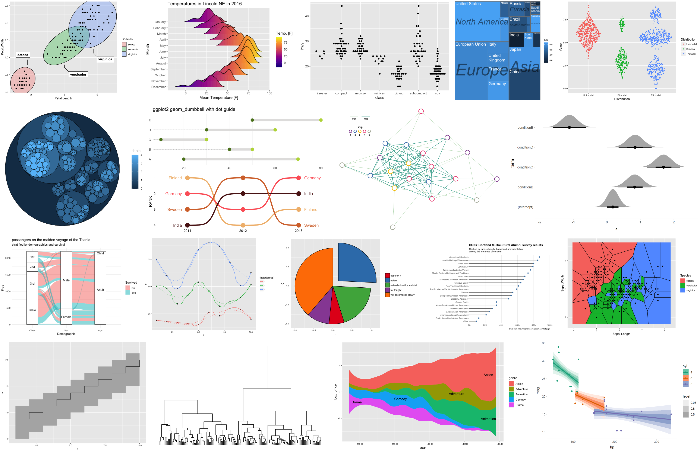
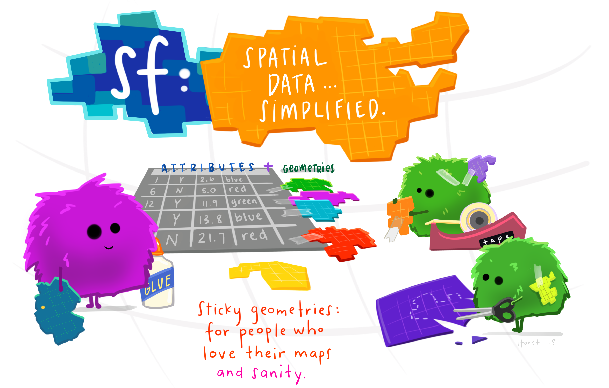

class: inverse, center
background-image: url("img/darklight_RichardStrozynski.jpg")
background-size: contain

```{r options, include = FALSE, purl=FALSE}
hook_source <- knitr::knit_hooks$get('source')
knitr::knit_hooks$set(source = function(x, options) {
  x <- stringr::str_replace(x, "^[[:blank:]]?([^*].+?)[[:blank:]]*#<<[[:blank:]]*$", "*\\1")
  hook_source(x, options)
})

knitr::opts_chunk$set(
  echo = TRUE, 
  warning = FALSE, 
  message = FALSE, 
  collapse = TRUE,
  fig.height = 6.3,
  fig.align = 'center',
  fig.retina = 3,
  dev = "ragg_png", 
  res = 1000
)

Sys.setlocale("LC_TIME", "C")

options(width = 80)
```

<br><br>
# Hands–On Data Visualization with <code style='color:#ebc500;'>ggplot2</code><br><b style='font-size:25pt;color:#a7a7a7;'>Segment 2: Build Plots Layer by Layer</b>
<br><br><br><br><br><br><br>
#### Dr. Cédric Scherer<b style='color:#ccba56;font-weight:400;line-height:150%;'><br>Pearson Live Training Session for O'Reilly<br>September 3, 2021</b ><br>

```{r prep, echo=FALSE}
library(tidyverse)
library(conflicted)
filter <- dplyr::filter
theme_set(theme_light(base_size = 18, base_family = "Roboto Condensed"))
data <- readr::read_csv("https://raw.githubusercontent.com/z3tt/hands-on-ggplot2/main/data/crypto_cleaned.csv")
set.seed(1)
```

---
background-image: url("img/bg-poll.png")
background-size: cover

## POLL: Which chart types do you use regularly? (MC)

<ul style='font-size:16pt;margin: 50px 50px;'>
<li style='margin-bottom: 15px;'>Pie or donut chart</li>
<li style='margin-bottom: 15px;'>Bubble chart</li>
<li style='margin-bottom: 15px;'>Dumbbell plot</li>
<li style='margin-bottom: 15px;'>Heatmap</li>
<li style='margin-bottom: 15px;'>Treemap</li>
<li style='margin-bottom: 15px;'>Network graph</li>
<li style='margin-bottom: 15px;'>Dendrogram</li>
<li style='margin-bottom: 15px;'>Gantt chart</li>
<li style='margin-bottom: 15px;'>Candlestick chart</li>
<li style='margin-bottom: 15px;'>Radar/spider chart</li>
<li style='margin-bottom: 15px;'>Sankey diagram</li>
<li style='margin-bottom: 15px;'>Maps (bubble, choropleth, ...)</li>
</ul>

---

## Create Any Chart Type

As you've seen, we can quickly switch through different chart types:

.pull-left[
```{r scatter, fig.height=5.6}
ggplot(data, aes(date, close, color = currency)) +
  geom_point() #<<
```
]

.pull-right[
```{r line, fig.height=5.6}
ggplot(data, aes(date, close, color = currency)) +
  geom_line() #<<
```
]

---

## Create Any Chart Type: Area Charts

As you've seen, we can quickly switch through different chart types:

```{r area, fig.width=16, fig.height=5.6}
ggplot(data, aes(date, close, color = currency)) +
  geom_area(aes(fill = currency), alpha = .5) #<<
```

---

## Create Any Chart Type: Area Charts

Many of the geom's can further adjusted:

```{r area-dodge, fig.width=16, fig.height=5.6}
ggplot(data, aes(date, close, color = currency)) +
  geom_area(aes(fill = currency), alpha = .5, position = "dodge") #<<
```

---

## Create Any Chart Type: Area Charts

Many of the geom's can further adjusted:

```{r area-fill, fig.width=16, fig.height=5.6}
ggplot(data, aes(date, close, color = currency)) +
  geom_area(aes(fill = currency), alpha = .5, position = "fill") #<<
```

---

## Create Any Chart Type: Area Charts

Many of the geom's can be further adjusted:

```{r area-fill-no-exp, fig.width=16, fig.height=5.6}
ggplot(data, aes(date, close, color = currency)) +
  geom_area(aes(fill = currency), alpha = .5, position = "fill") +
  coord_cartesian(expand = FALSE) #<<
```

---

## Create Any Chart Type: Box Plots

Some geom's drastically change the appearance of the data:

```{r boxplot, fig.width=16, fig.height=5.6}
ggplot(data, aes(close, currency)) +
  geom_boxplot() #<<
```

---

## Create Any Chart Type: Box Plots

And, as you already know, we can combine geom's to make the plot more insightful:

```{r boxplot-dots, fig.width=16, fig.height=5.6}
ggplot(data, aes(close, currency)) +
  geom_boxplot(outlier.alpha = 0, color = "grey60", size = 1) + 
  geom_point(alpha = .2) #<<
```

---

## Create Any Chart Type: Jitterstrips

... and also the point geom can be adjusted:

```{r boxplot-jitter, fig.width=16, fig.height=5.6}
ggplot(data, aes(close, currency)) +
  geom_boxplot(outlier.alpha = 0, color = "grey60", size = 1) + 
  geom_point(alpha = .2, position = position_jitter(height = .2)) #<<
```

---

## Create Any Chart Type: Barcode Plots

... and also the point geom can be adjusted:

```{r boxplot-barcode, fig.width=16, fig.height=5.6}
ggplot(data, aes(close, currency)) +
  geom_boxplot(outlier.alpha = 0, color = "grey60", size = 1) + 
  geom_point(alpha = .1, shape = "|", size = 9) #<<
```

---

## Create Any Chart Type: Barcode Plots

... and also the point geom can be adjusted:

```{r boxplot-barcode-nudge, fig.width=16, fig.height=5.6}
ggplot(data, aes(close, currency)) +
  geom_boxplot(outlier.alpha = 0, width = .4, position = position_nudge(y = .2)) + #<<
  geom_point(alpha = .1, shape = "|", size = 9, position = position_nudge(y = -.2)) #<<
```

---

## Create Any Chart Type: Hexagonal Bin Plot

Plots that bin the data can be helpful to deal with overplotting:

.pull-left[
```{r scatter-open-close, fig.height=5.3}
ggplot(data, aes(open, close)) +
  geom_point(alpha = .3)
```
]

.pull-right[
```{r hex-open-close, fig.height=5.3}
ggplot(data, aes(open, close)) +
  geom_hex()
```
]

---

## Create Any Chart Type: Hexagonal Bin Plot

Let's add the diagonal to the plot:

.pull-left[
```{r scatter-open-close-diag, fig.height=5.1}
ggplot(data, aes(open, close)) +
  geom_abline(slope = 1, intercept = 0) + #<<
  geom_point(alpha = .3) +
  coord_fixed() #<<
```
]

.pull-right[
```{r hex-open-close-diag, fig.height=5.1}
ggplot(data, aes(open, close)) +
  geom_abline(slope = 1, intercept = 0) + #<<
  geom_hex() +
  coord_fixed() #<<
```
]

---

## Create Any Chart Type: Rectangular Bin Plot

If you don't like hexagonals, use rectangles!

.pull-left[
```{r scatter-open-close-diag-2, fig.height=5.1}
ggplot(data, aes(open, close)) +
  geom_abline(slope = 1, intercept = 0) +
  geom_point(alpha = .3) +
  coord_fixed() 
```
]

.pull-right[
```{r rect-open-close-diag, fig.height=5.1}
ggplot(data, aes(open, close)) +
  geom_abline(slope = 1, intercept = 0) +
  geom_bin2d() + #<<
  coord_fixed()
```
]

---

## Create Any Chart Type: Rectangular Bin Plot

Actually, they map to a hidden summary statistic that is calculated by `{ggplot2}`:

.pull-left[
```{r rect-density, fig.height=5.1}
ggplot(data, aes(open, close)) +
  geom_abline(slope = 1, intercept = 0) +
  geom_bin2d(aes(fill = ..density..)) + #<<
  coord_fixed() 
```
]

.pull-right[
```{r rect-count, fig.height=5.1}
ggplot(data, aes(open, close)) +
  geom_abline(slope = 1, intercept = 0) +
  geom_bin2d(aes(fill = ..count..)) + #<<
  coord_fixed()
```
]

---

## Create Any Chart Type: Heatmaps

With `geom_tile()` one can create heatmaps:

```{r heatmap, fig.width=16, fig.height=5.6}
ggplot(data, aes(date, currency, fill = close)) +
  geom_tile()
```

---

## Create Any Chart Type: Heatmaps

With `geom_tile()` one can create heatmaps:

```{r heatmap-expand, fig.width=16, fig.height=5.6}
ggplot(data, aes(date, currency, fill = close)) +
  geom_tile() +
  coord_cartesian(expand = FALSE) #<<
```

---
class: inverse, center, middle

# <b style='font-size:70pt;color:#ebc500;'>Statistical Transformations</b><br><br>

---

## Statistical Transformations: Draw Fittings

You can directly add smoothed conditional means:

```{r stats-smooth2, fig.width=16, fig.height=4.3}
ggplot(data, aes(date, close, color = currency)) +
  geom_point(size = .1) +
  stat_smooth() #<< 
```

---

## Statistical Transformations: Draw Fittings

You can directly add smoothed conditional means:

```{r stats-smooth2-again, fig.width=16, fig.height=4.3}
ggplot(data, aes(date, close, color = currency)) +
  geom_point(size = .1) +
  stat_smooth() #<< 
```

<span style='font-size:13pt;'>By default this adds a <b>LOESS</b> (locally weighted scatter plot smoothing) or a <b>GAM</b> (generalized additive model) depending on the<br>number of data points (GAM in case of ≥ 1000 observations).</span>

---

## Statistical Transformations: Draw Fittings

You can specify the fitting method and the formula:

```{r stats-smooth-polynom, fig.width=16, fig.height=4.3}
ggplot(data, aes(date, close, color = currency)) +
  geom_point(size = .1) +
  stat_smooth(method = "lm", formula = y ~ x + I(x^2) +  I(x^3) + I(x^4)) #<<
```

---

## Statistical Transformations: Draw Fittings

You can specify the fitting method and the formula:

```{r stats-smooth-polynom-again, fig.width=16, fig.height=4.3}
ggplot(data, aes(date, close, color = currency)) +
  geom_point(size = .1) +
  stat_smooth(method = "lm", formula = y ~ x + I(x^2) +  I(x^3) + I(x^4)) #<<
```

<span style='font-size:13pt;'>Other methods such as <code>method = "lm"</code> (without an explicit formula) for simple linear regressions and <code>method = "glm"</code> for<br>generalized linear models are available as well.</span>

---

## Statistical Transformations: Calculate Summaries

Without pre-calculations one can easily plot data summaries:

.pull-left[
```{r stats-summary, eval=FALSE}
ggplot(data, aes(currency, close)) +
  stat_summary() #<<
```
]

.pull-right[
```{r plot-stats-summary, ref.label="stats-summary", echo=FALSE}
```
]

---

## <b><code>stat\_\*()</code></b> versus <b><code>geom\_\*()</code></b>

You can go both ways — `stat_x(geom = "y") == geom_y(stat = "x")`:

.pull-left[
```{r statgeom, fig.height=5.1}
ggplot(data, aes(open, close)) +
  stat_identity(geom = "point") #<<
```
]

.pull-right[
```{r geomstat, fig.height=5.1}
ggplot(data, aes(open, close)) +
  geom_point(stat = "identity") #<<
```
]

---

## <b><code>stat\_\*()</code></b> versus <b><code>geom\_\*()</code></b>

You can go both ways — `stat_x(geom = "y") == geom_y(stat = "x")`:

.pull-left[
```{r statgeom-2, fig.height=5.1}
ggplot(data, aes(factor(month), close)) +
  stat_summary(geom = "pointrange") #<<
```
]

.pull-right[
```{r geomstat-2, fig.height=5.1}
ggplot(data, aes(factor(month), close)) +
  geom_pointrange(stat = "summary") #<<
```
]

---

## Statistical Transformations: Calculate Summaries

Without pre-calculations one can easily plot data summaries:

.pull-left[
```{r stats-summary-default, eval=FALSE}
ggplot(data, aes(currency, close)) +
  stat_summary(
    geom = "pointrange", #<<
    fun.data = "mean_se" #<<
  )
```
]

.pull-right[
```{r plot-stats-summary-default, ref.label="stats-summary-default", echo=FALSE}
```
]

---

## Statistical Transformations: Calculate Summaries

Without pre-calculations one can easily plot data summaries:

.pull-left[
```{r stats-summary-custom, eval=FALSE}
ggplot(data, aes(currency, close)) +
  stat_summary(
    fun = function(x) mean(x), #<<
    fun.min = function(x) mean(x) - sd(x), #<<
    fun.max = function(x) mean(x) + sd(x) #<<
  ) 
```
]

.pull-right[
```{r plot-stats-summary-custom, ref.label="stats-summary-custom", echo=FALSE}
```
]

---

## Statistical Transformations: Calculate Summaries

Without pre-calculations one can easily plot data summaries:

.pull-left[
```{r stats-summary-custom-label, eval=FALSE}
ggplot(data, aes(currency, close)) +
  stat_summary(
    fun = function(x) mean(x),
    fun.min = function(x) mean(x) - sd(x),
    fun.max = function(x) mean(x) + sd(x)
  ) +
  stat_summary( #<<
      geom = "text", #<<
      aes(label = round(..y.., 2)) #<<
  ) #<<
```
]

.pull-right[
```{r plot-stats-summary-custom-label, ref.label="stats-summary-custom-label", echo=FALSE}
```
]

---

## Statistical Transformations: Calculate Summaries

Without pre-calculations one can easily plot data summaries:

.pull-left[
```{r stats-summary-custom-label-warning, eval=FALSE}
ggplot(data, aes(currency, close)) +
  stat_summary(
    fun = function(x) mean(x),
    fun.min = function(x) mean(x) - sd(x),
    fun.max = function(x) mean(x) + sd(x)
  ) +
  stat_summary(
      geom = "text",
      fun = function(x) mean(x), #<<
      aes(label = round(..y.., 2))
  )
```
]

.pull-right[
```{r plot-stats-summary-custom-label-warning, ref.label="stats-summary-custom-label-warning", echo=FALSE}
```
]

---

## Statistical Transformations: Calculate Summaries

Without pre-calculations one can easily plot data summaries:

.pull-left[
```{r stats-summary-custom-label-adj, eval=FALSE}
ggplot(data, aes(currency, close)) +
  stat_summary(
    fun = function(x) mean(x),
    fun.min = function(x) mean(x) - sd(x),
    fun.max = function(x) mean(x) + sd(x)
  ) +
  stat_summary(
      geom = "text",
      fun = function(x) mean(x),
      aes(label = round(..y.., 2)),
      size = 5, #<<
      hjust = -.5 #<<
  )
```
]

.pull-right[
```{r plot-stats-summary-custom-label-adj, ref.label="stats-summary-custom-label-adj", echo=FALSE}
```
]

---

## Create Any Chart Type: Dumbbell Plot

Without pre-calculations one can easily plot data summaries:

.pull-left[
```{r stats-summary-dumbbell-1, eval=FALSE}
ggplot(data, aes(currency, close)) +
  stat_summary( #<<
    geom = "linerange", #<<
    fun.min = "min", #<<
    fun.max = "max" #<<
  )  #<<
```
]

.pull-right[
```{r plot-stats-summary-dumbbell-1, ref.label="stats-summary-dumbbell-1", echo=FALSE}
```
]

---

## Create Any Chart Type: Dumbbell Plot

Without pre-calculations one can easily plot data summaries:

.pull-left[
```{r stats-summary-dumbbell-2, eval=FALSE}
ggplot(data, aes(currency, close)) +
  stat_summary(
    geom = "linerange",
    fun.min = "min",
    fun.max = "max"
  ) +
  stat_summary( #<<
    fun = "range" #<<
  )  #<<
```
]

.pull-right[
```{r plot-stats-summary-dumbbell-2, ref.label="stats-summary-dumbbell-2", echo=FALSE}
```
]

---

## Create Any Chart Type: Dumbbell Plot

Without pre-calculations one can easily plot data summaries:

.pull-left[
```{r stats-summary-dumbbell-3, eval=FALSE}
ggplot(data, aes(currency, close)) +
  stat_summary(
    geom = "linerange",
    fun.min = "min",
    fun.max = "max"
  ) +
  stat_summary(
    fun = "range"
  ) +
  stat_summary( #<<
    fun = "range", #<<
    aes(label = round(..y.., 2)), #<<
    geom = "text", #<<
    size = 4, #<<
    hjust = 1, #<<
    position = position_nudge(x = -.08) #<<
  ) #<<
```
]

.pull-right[
```{r plot-stats-summary-dumbbell-3, ref.label="stats-summary-dumbbell-3", echo=FALSE}
```
]

---

## Statistical Transformations: <b><code>stat\_\*()</code></b>

<br>
There are several other statistical transformations available:

<ul style='font-size:16pt;margin: 20px 20px;'>
<li style='margin-bottom: 17px;'><code>stat_count</code> to count observations (e.g. for bar charts)</li>
<li style='margin-bottom: 17px;'><code>stat_bin</code> and <code>stat_bin2d</code> to count observations per bin (e.g. for histograms)</li>
<li style='margin-bottom: 17px;'><code>stat_density</code>  and <code>stat_density2d</code> to compute kernel density estimates (e.g. for density curves)</li>
<li style='margin-bottom: 17px;'><code>stat_contour</code> and <code>stat_contour_filled</code> to retrieve threshold levels (e.g. for contour maps)</li>
<li style='margin-bottom: 17px;'><code>stat_function</code> to draw functions as continuous curves</li>
<li style='margin-bottom: 17px;'><code>stat_boxplot</code> to calculate the five summary statistics for a box plot</li>
<li style='margin-bottom: 17px;'><code>stat_ydensity</code> to compute vertical density estimates (e.g. for violin plots)</li>
</ul>

---

background-image: url("img/bg-exercise.png")
background-size: cover

## Exercise 1:

* Import the password data set:<br>https://raw.githubusercontent.com/Z3tt/ggplot-courses/master/data/passwords.csv

* Visualize the number of passwords per category as bar chart.

* Add to each bar a label of the number of passwords.

---

## Exercise 1: Import the Data

```{r data-password}
passwords <- readr::read_csv(
  "https://raw.githubusercontent.com/Z3tt/ggplot-courses/master/data/passwords.csv"
)

glimpse(passwords)
```

---

## Exercise 1: Number of Passwords per Category

```{r password-geom-bar, fig.width=16, fig.height=5.6}
ggplot(passwords, aes(category)) +
  geom_bar() ## stat = "count" is the default #<<
```

---

## Exercise 1: Number of Passwords per Category

```{r password-geom-bar-stat, fig.width=16, fig.height=5.6}
ggplot(passwords, aes(category)) + 
  stat_count() ## geom = "bar" is the default #<<
```

---

## Exercise 1: Number of Passwords per Category

```{r password-geom-col-data}
passwords %>% #<<
  count(category) #<<
```

---

## Exercise 1: Number of Passwords per Category

```{r password-geom-col, fig.width=16, fig.height=5.3}
passwords %>% 
  count(category) %>%  
  ggplot(aes(category, n)) + #<<
  geom_col() #<<
```

---

## Exercise 1: Number of Passwords per Category

```{r password-geom-col-pre, fig.width=16, fig.height=5.3}
pw_count <- count(passwords, category) #<<

ggplot(pw_count, aes(category, n)) + #<<
  geom_col()
```

---

## Exercise 1: Number of Passwords per Category

.pull-left[
```{r geom-col}
ggplot(pw_count, aes(n, category)) +
  geom_col() #<<
```
]

.pull-right[
```{r geom-bar}
ggplot(pw_count, aes(n, category)) +
  geom_bar(stat = "identity") #<<
```
]

---

## Exercise 1: Number of Passwords per Category

```{r password-col-sorted, fig.width=16, fig.height=5.3}
pw_count <- count(passwords, category)

ggplot(pw_count, aes(fct_reorder(category, -n), n)) + #<<
  geom_col()
```

---

## Exercise 1: Labels Number of Passwords per Category

```{r password-label-geom, fig.width=16, fig.height=5.3}
ggplot(pw_count, aes(fct_reorder(category, -n), n)) +
  geom_col() +
  geom_text(aes(label = n), vjust = -.6, size = 6) #<<
```

---

## Exercise 1: Fix Limits

```{r password-label-geom-yscale, fig.width=16, fig.height=5.3}
ggplot(pw_count, aes(fct_reorder(category, -n), n)) + 
  geom_col() +
  geom_text(aes(label = n), vjust = -.6, size = 6) +
  scale_y_continuous(limits = c(NA, 210), expand = c(0, 0)) #<<
```

---

## Exercise 1: Labels Number of Passwords per Category

```{r password-label-stat-count, fig.width=16, fig.height=5.3}
ggplot(passwords, aes(category)) + #<<
  stat_count() +  #<<
  stat_count(geom = "text", aes(label = ..count..), vjust = -.6, size = 6) + #<<
  scale_y_continuous(limits = c(NA, 210), expand = c(0, 0))
```

---

## Exercise 1: Labels Number of Passwords per Category

```{r password-label-stat-summary, fig.width=16, fig.height=5.3}
ggplot(passwords, aes(category, 1)) + #<<
  stat_summary(geom = "bar", fun = length) + #<<
  stat_summary(geom = "text", aes(label = ..y..), fun = length, vjust = -.6, size = 6) + #<<
  scale_y_continuous(limits = c(NA, 210), expand = c(0, 0))
```

---
class: center, middle, inverse

<br><cap>Collection of some chart types provided by ggplot2 extension packages.</cap>

---
class: center, middle

<br><cap>Illustration by Allison Horst</cap>

---
class: inverse, center, middle

# <b style='font-size:70pt;color:#ebc500;'>Spatial Maps</b><br><br>

---

## Spatial Maps

<br>

### Simple Features (Access)

[**Simple features** or **simple features access**](https://r-spatial.github.io/sf/articles/sf1.html) refers to a formal standard (ISO 19125-1:2004) that describes how objects in the real world can be represented in computers, with emphasis on the *spatial geometry*.

`{sf}` is an R package that provides simple features access for R.

---

## Spatial Maps

<br>

### Simple Features (Access)

[**Simple features** or **simple features access**](https://r-spatial.github.io/sf/articles/sf1.html) refers to a formal standard (ISO 19125-1:2004) that describes how objects in the real world can be represented in computers, with emphasis on the *spatial geometry*.

`{sf}` is an R package that provides simple features access for R.

<br>

### Natural Earth

[**Natural Earth**](https://www.naturalearthdata.com/) is a <u>public domain map data set</u> of *physical and cultural features*, available at 1:10m, 1:50m,<br>and 1:110 million scales. 

`{rnaturalearth}` is an R package to hold and facilitate interaction with Natural Earth map data.

---
background-image: url("img/bg-poll.png")
background-size: cover

## POLL: Have you used R to visualize spatial data? (MC)


<ul style='font-size:26pt;margin: 50px 50px;'>
<li style='margin-bottom: 15px;'>No, I never deal with spatial data.</li>
<li style='margin-bottom: 15px;'>No, I use other tools for spatial data.</li>
<li style='margin-bottom: 15px;'>Yes, <code>ggplot2::geom_polygon()</code>.</li>
<li style='margin-bottom: 15px;'>Yes, <code>ggplot2::geom_raster()</code>.</li>
<li style='margin-bottom: 15px;'>Yes, <code>ggplot2::geom_sf()</code>.</li>
<li style='margin-bottom: 15px;'>Yes, the <code>{tmap}</code> package.</li>
<li style='margin-bottom: 15px;'>Yes, the <code>{ggmap}</code> package.</li>
<li style='margin-bottom: 15px;'>Yes, some other R packages that are not mentioned here.</li>
</ul>

---

## Setup

```{r sf-rnaturalearth-packages}
#install.packages("sf")
library(sf)

#install.packages("rnaturalearth")
library(rnaturalearth)
```

---

## Get the Data

The `{rnaturalearth}` allows downloading the Natural Earth data sets in simple feature format.

```{r rnatural-earth-download}
sf_world <- ne_countries(returnclass = "sf")
sf_airports <- ne_download(scale = "large", category = "cultural", type = "airports", returnclass = "sf")

tibble::glimpse(sf_world)
```

---

## Plot the Map

`{ggplot2}` comes with a set of `geom`, `stat`, and `coord` are used to visualize sf objects. 

```{r first-map, fig.width=16, fig.height=5.6}
ggplot(sf_world) +
  geom_sf()
```

---

## Plot the Map

`geom_sf()` works with all types of vector data and returns geometries depending on the simple features:

```{r sf-polygon-point, fig.width=16, fig.height=5.6}
ggplot(sf_world) +
  geom_sf() +
  geom_sf(data = sf_airports) #<<
```

---

## Plot the Map

`geom_sf()` works with all types of vector data and returns geometries depending on the simple features:

```{r first-map-colors, fig.width=16, fig.height=5.6}
ggplot(sf_world) +
  geom_sf(color = "forestgreen", alpha = .4) + #<<
  geom_sf(data = sf_airports, color = "purple", alpha = .4) #<<
```

---

## Generate Own Simple Features Objects

`geom_sf()` works with all types of vector data and returns geometries depending on the simple features:

```{r data-locator}
sf_bln <- sf::st_sfc(sf::st_point(c(13.4050, 52.5200)), crs = sf::st_crs(sf_world)) #<<

sf_bln
```

---

## Plot the Map

`geom_sf()` works with all types of vector data and returns geometries depending on the simple features:

```{r first-map-locator, fig.width=16, fig.height=5.6}
ggplot(sf_world) +
  geom_sf(color = NA) + #<<
  geom_sf(data = sf_bln, shape = 21, color = "firebrick", fill = NA, size = 5, stroke = 2) #<<
```

---

## Plot the Map

`{ggplot2}` comes with a set of `geom`, `stat`, and `coord` are used to visualize sf objects.

```{r first-map-fill, fig.width=16, fig.height=5.6}
ggplot(sf_world) +
  geom_sf(color = "forestgreen", fill = "forestgreen", alpha = .4) #<<
```

---

## Plot the Map

`{ggplot2}` comes with a set of `geom`, `stat`, and `coord` are used to visualize sf objects. 

```{r first-map-fill-economy, fig.width=16, fig.height=5.6}
ggplot(sf_world) +
  geom_sf(aes(fill = economy)) #<<
```

---

## Plot the Map

`{ggplot2}` comes with a set of `geom`, `stat`, and `coord` are used to visualize sf objects. 

```{r first-map-color, fig.width=16, fig.height=5.6}
ggplot(sf_world) +
  geom_sf(aes(fill = economy), color = "white", size = .2) #<<
```

---

## Change the Projection

`{ggplot2}` comes with a set of `geom`, `stat`, and `coord` are used to visualize sf objects. 

```{r first-map-proj-moll, fig.width=16, fig.height=5.4}
ggplot(sf_world) +
  geom_sf(aes(fill = economy), color = "white", size = .2) +
  coord_sf(crs = "+proj=moll") #<<
```

---

## Change the Projection

`{ggplot2}` comes with a set of `geom`, `stat`, and `coord` are used to visualize sf objects. 

```{r first-map-proj-custom1, fig.width=16, fig.height=5.4}
ggplot(sf_world) +
  geom_sf(aes(fill = economy), color = "white", size = .2) +
  coord_sf(crs = "+proj=laea +x_0=0 +y_0=0 +lon_0=0 +lat_0=0") #<<
```

---

## Change the Projection

`{ggplot2}` comes with a set of `geom`, `stat`, and `coord` are used to visualize sf objects. 

```{r first-map-proj-custom2, fig.width=16, fig.height=5.4}
ggplot(sf_world) +
  geom_sf(aes(fill = economy), color = "white", size = .2) +
  coord_sf(crs = "+proj=laea +x_0=0 +y_0=0 +lon_0=-30 +lat_0=-25") #<<
```

---

## Change the Projection

`{ggplot2}` comes with a set of `geom`, `stat`, and `coord` are used to visualize sf objects. 

```{r first-map-proj-custom3, fig.width=16, fig.height=5.6}
ggplot(sf_world) +
  geom_sf(aes(fill = economy), color = "white", size = .2) +
  coord_sf(crs = "+proj=laea +x_0=0 +y_0=0 +lon_0=-70 +lat_0=0") #<<
```

---
background-image: url("img/bg-exercise.png")
background-size: cover

## Exercise 2:

* Download data set(s) for your home country and plot it/them.

* Change the projection with `coord_sf` and observe how the spatial mapping changes.

---

## Exercise 2: Load the Data

```{r data-germany}
sf_germany <- rnaturalearth::ne_countries(country = "Germany", returnclass = "sf")
sf_germany_hd <- rnaturalearth::ne_countries(country = "Germany", scale = 10, returnclass = "sf")

class(sf_germany)
names(sf_germany)
```

---

## Exercise 2: Plot the Data

.pull-left[
```{r data-germany-lowres}
ggplot(sf_germany) +  #<<
  geom_sf(fill = "#CBE7BE")
```
]

.pull-right[
```{r data-germany-highres}
ggplot(sf_germany_hd) + #<<
  geom_sf(fill = "#CBE7BE")
```
]

---

## Exercise 2: Change Projection

.pull-left[
```{r data-germany-crs-proj4, fig.height=6.2}
ggplot(sf_germany) + 
  geom_sf(fill = "#CBE7BE") +
  coord_sf(crs = "+proj=lcc +lat_1=48.66 +lat_2=53.66 +lat_0=51 +lon_0=10.5 +ellps=GRS80") #<<
```
]

.pull-right[
```{r data-germany-crs-epsg}
ggplot(sf_germany) + 
  geom_sf(fill = "#CBE7BE") +
  coord_sf(crs = st_crs(5243)) #<<
```
]

---

## Exercise 2: Change Projection

.pull-left[
```{r data-germany-crs-screwed, fig.height = 5.8}
ggplot(sf_germany) + 
  geom_sf(fill = "#CBE7BE") +
  coord_sf(crs = "+proj=moll") #<<
```
]

.pull-right[
```{r data-germany-crs-screwed2, fig.height = 5.8}
ggplot(sf_germany) + 
  geom_sf(fill = "#CBE7BE") +
  coord_sf(crs = "+proj=laea +lon_0=-70 +lat_0=0") #<<
```
]

---

## Exercise 2: Add Location

.pull-left[
```{r data-germany-crs-screwed-loc, fig.height = 5.8}
ggplot(sf_germany) + 
  geom_sf(fill = "#CBE7BE") +
  geom_sf(data = sf_bln, size = 5) + #<<
  coord_sf(crs = "+proj=moll")
```
]

.pull-right[
```{r data-germany-crs-screwed2-loc, fig.height = 5.8}
ggplot(sf_germany) + 
  geom_sf(fill = "#CBE7BE") +
  geom_sf(data = sf_bln, size = 5) + #<<
  coord_sf(crs = "+proj=laea +lon_0=-70 +lat_0=0")
```
]

---

## Resources

* Chapters on [individual geom's](https://ggplot2-book.org/individual-geoms.html), [collective geom's](https://ggplot2-book.org/collective-geoms.html), [statistical summaries](https://ggplot2-book.org/statistical-summaries.html), and [maps](https://ggplot2-book.org/maps.html)<br>of the “ggplot2” book by Hadley Wickham et al.

* [Overview of layers](https://ggplot2.tidyverse.org/reference/) contained in the `{ggplot2}` package

* [R Graph Gallery](https://www.r-graph-gallery.com/) that provides hundreds of charts with their reproducible code

* List of [`{ggplot2}` extension packages](https://exts.ggplot2.tidyverse.org/)

* [“Geocomputation with R”](https://geocompr.robinlovelace.net/), free-access book by Robin Lovelace et al.

* [`{sf}` package page](https://r-spatial.github.io/sf/)

* [StackOverflow discussion](https://github.com/r-spatial/sf/issues/1050) and [code](https://gist.github.com/fzenoni/ef23faf6d1ada5e4a91c9ef23b0ba2c1) to plot a true globe

* [“A `{ggplot2}` Tutorial for Beautiful Plotting in R”](https://www.cedricscherer.com/2019/08/05/a-ggplot2-tutorial-for-beautiful-plotting-in-r/), my extensive "how to"-tutorial

---
class: inverse, center, middle

# <b style='font-size:70pt;color:lightgray;'>APPENDIX</b><br><br>

---

## Create Any Chart Type: Candlestick Charts

There is a package for that — but it's simple enough to do it manually!

```{r candle-step-1, fig.width=16, fig.height=5.6}
ggplot(filter(data, year == 2019, month > 9), aes(date, close)) +
  geom_linerange(aes(ymin = low, ymax = high), size = 1) #<<
```

---

## Create Any Chart Type: Candlestick Charts

There is a package for that — but it's simple enough to do it manually!

```{r candle-step-2, fig.width=16, fig.height=5.6}
ggplot(filter(data, year == 2019, month > 9), aes(date, close)) +
  geom_linerange(aes(ymin = low, ymax = high), size = 1) +
  geom_linerange(aes(ymin = open, ymax = close), size = 5) #<<
```

---

## Create Any Chart Type: Candlestick Charts

There is a package for that — but it's simple enough to do it manually!

```{r candle-color, fig.width=16, fig.height=5.6}
ggplot(filter(data, year == 2019, month > 9), aes(date, close)) +
  geom_linerange(aes(ymin = low, ymax = high, color = close > open), size = 1) + #<<
  geom_linerange(aes(ymin = open, ymax = close, color = close > open), size = 5) #<<
```

---

## Create Any Chart Type: Candlestick Charts

There is a package for that — but it's simple enough to do it manually!

```{r candle-scale-date, fig.width=16, fig.height=5.3}
ggplot(filter(data, year == 2019, month > 9), aes(date, close)) +
  geom_linerange(aes(ymin = low, ymax = high, color = close > open), size = 1) + 
  geom_linerange(aes(ymin = open, ymax = close, color = close > open), size = 5) +
  scale_x_date(date_labels = "%b %d, %Y") #<<
```

---

## Statistical Transformations: Draw Functions

`stat_function()` makes it easy to add a function to a plot, either continuous or discrete:

.pull-left[
```{r stats-function, eval=FALSE}
ggplot(tibble(x = c(-8, 8)), aes(x)) +
  stat_function(fun = dnorm) + #<<
  stat_function( #<<
    fun = dcauchy, #<<
    color = "red", #<<
    n = 75 #<<
  )  #<<
```
]

.pull-right[
```{r plot-stats-function, ref.label="stats-function", echo=FALSE}
```
]