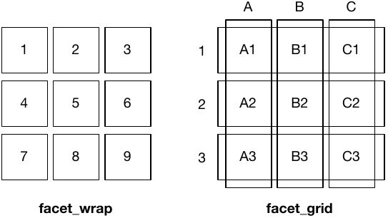

class: inverse, center
background-image: url("img/darklight_RichardStrozynski.jpg")
background-size: contain

```{r options, include = FALSE, purl=FALSE}
hook_source <- knitr::knit_hooks$get('source')
knitr::knit_hooks$set(source = function(x, options) {
  x <- stringr::str_replace(x, "^[[:blank:]]?([^*].+?)[[:blank:]]*#<<[[:blank:]]*$", "*\\1")
  hook_source(x, options)
})

knitr::opts_chunk$set(
  echo = TRUE, 
  warning = FALSE, 
  message = FALSE, 
  collapse = TRUE,
  fig.height = 6.3,
  fig.align = 'center',
  fig.retina = 3,
  dev = "ragg_png", 
  res = 1000
)

Sys.setlocale("LC_TIME", "C")

options(width = 80)
```

<br><br>
# Hands–On Data Visualization with <code style='color:#ebc500;'>ggplot2</code><br><b style='font-size:25pt;color:#a7a7a7;'>Segment 5: Create Multipanel Figures</b>
<br><br><br><br><br><br><br>
#### Dr. Cédric Scherer<b style='color:#ccba56;font-weight:400;line-height:150%;'><br>Pearson Live Training Session for O'Reilly<br>September 3, 2021</b ><br>

```{r prep, echo=FALSE}
library(tidyverse)
library(conflicted)
filter <- dplyr::filter
theme_set(theme_light(base_size = 18, base_family = "Roboto Condensed"))
data <- readr::read_csv("https://raw.githubusercontent.com/z3tt/hands-on-ggplot2/main/data/crypto_cleaned.csv")
```

---
class: inverse, center, middle

# <b style='font-size:70pt;color:#ebc500;'>Facets</b><br><b style='font-size:45pt;color:white;'>Small Multiples</b><br><br>

---

## <b><code>facet\_\*()</code></b>

<p style='text-align:center;'><br><br><cap>Adapted from "ggplot2: Elegant Graphics for Data Analysis" by Hadley Wickham</cap></p>

---

## Our Small-Multiple Candidate

The well-known plot we are going to use for our small multiples, saved as `g`.

.pull-left[
```{r facet-no, eval=FALSE}
g <- 
  ggplot(data, aes(date, close)) +
    geom_line(
      aes(color = currency),
      size = 1
    ) +
    scale_x_date(
      date_labels = "%m/%y",
      expand = c(0, 0)
    ) +
    scale_y_continuous(
      labels = scales::dollar_format()
    ) +
    scale_color_brewer(
      palette = "Set1",
      guide = "none"
    )

g
```
]

.pull-right[
```{r plot-facet-no, ref.label="facet-no", echo=FALSE}
```
]

---

## <b><code>facet_wrap()</code></b>

`facet_wrap()` splits the data into small multiples based on **one grouping variable**:


.pull-left[
```{r facet-wrap-year, eval=FALSE}
g +
  facet_wrap(vars(year)) #<<
```
]

.pull-right[
```{r plot-facet-wrap-year, ref.label="facet-wrap-year", echo=FALSE}
```
]

---

## <b><code>facet_wrap()</code></b>

`facet_wrap()` splits the data into small multiples based on **one grouping variable**:


.pull-left[
```{r facet-wrap-currency, eval=FALSE}
g +
  facet_wrap(vars(currency)) #<<
```
]

.pull-right[
```{r plot-facet-wrap-currency, ref.label="facet-wrap-currency", echo=FALSE}
```
]

---

## <b><code>facet_wrap()</code></b>

`facet_wrap()` splits the data into small multiples based on **one grouping variable**:

.pull-left[
```{r facet-wrap-currency-2, eval=FALSE}
g +
  facet_wrap(~ currency) #<<
```
]

.pull-right[
```{r plot-facet-wrap-currency-2, ref.label="facet-wrap-currency-2", echo=FALSE}
```
]

---

## <b><code>facet_wrap()</code></b>

`facet_wrap()` splits the data into small multiples based on **one grouping variable**:

.pull-left[
```{r facet-wrap-scales-free, eval=FALSE}
g +
  facet_wrap(
    vars(currency),
    scales = "free" #<<
  )
```
]

.pull-right[
```{r plot-facet-wrap-scales-free, ref.label="facet-wrap-scales-free", echo=FALSE}
```
]

---

## <b><code>facet_wrap()</code></b>

`facet_wrap()` splits the data into small multiples based on **one grouping variable**:

.pull-left[
```{r facet-wrap-scales-free-y, eval=FALSE}
g +
  facet_wrap(
    vars(currency),
    scales = "free_y" #<<
  )
```
]

.pull-right[
```{r plot-facet-wrap-scales-free-y, ref.label="facet-wrap-scales-free-y", echo=FALSE}
```
]
---

## <b><code>facet_wrap()</code></b>

`facet_wrap()` splits the data into small multiples based on **one grouping variable**:

.pull-left[
```{r facet-wrap-nrow, eval=FALSE}
g +
  facet_wrap(
    vars(currency),
    nrow = 1 #<<
  )
```
]

.pull-right[
```{r plot-facet-wrap-nrow, ref.label="facet-wrap-nrow", echo=FALSE}
```
]

---

## <b><code>facet_wrap()</code></b>

`facet_wrap()` splits the data into small multiples based on **one grouping variable**:

.pull-left[
```{r facet-wrap-ncol, eval=FALSE}
g +
  facet_wrap(
    vars(currency),
    ncol = 1 #<<
  )
```
]

.pull-right[
```{r plot-facet-wrap-ncol, ref.label="facet-wrap-ncol", echo=FALSE}
```
]

---

## <b><code>facet_grid()</code></b>

`facet_grid()` spans a grid of each combination of **two grouping variables**:

.pull-left[
```{r facet-grid, eval=FALSE}
g +
  facet_grid( #<<
    cols = vars(currency), #<<
    rows = vars(year) #<<
  ) #<<
```
]

.pull-right[
```{r plot-facet-grid, ref.label="facet-grid", echo=FALSE}
```
]

---

## <b><code>facet_grid()</code></b>

`facet_grid()` spans a grid of each combination of **two grouping variables**:

.pull-left[
```{r facet-grid-2, eval=FALSE}
g +
  facet_grid(
    year ~ currency #<<
  )
```
]

.pull-right[
```{r plot-facet-grid-2, ref.label="facet-grid-2", echo=FALSE}
```
]

---

## <b><code>facet_grid()</code></b>

`facet_grid()` spans a grid of each combination of **two grouping variables**:

.pull-left[
```{r facet-grid-2-inv, eval=FALSE}
g +
  facet_grid(
    currency ~ year #<<
  )
```
]

.pull-right[
```{r plot-facet-grid-2-inv, ref.label="facet-grid-2-inv", echo=FALSE}
```
]

---

## <b><code>facet_grid()</code></b>

`facet_grid()` spans a grid of each combination of **two grouping variables**:

.pull-left[
```{r facet-grid-inv-scales, eval=FALSE}
g +
  facet_grid(
    currency ~ year,
    scales = "free" #<<
  )
```
]

.pull-right[
```{r plot-facet-grid-inv-scales, ref.label="facet-grid-inv-scales", echo=FALSE}
```
]

---

## <b><code>facet_grid()</code></b>

`facet_grid()` spans a grid of each combination of **two grouping variables**:

.pull-left[
```{r facet-grid-inv-scales-y, eval=FALSE}
g +
  facet_grid(
    currency ~ year,
    scales = "free_y" #<<
  )
```
]

.pull-right[
```{r plot-facet-grid-inv-scales-y, ref.label="facet-grid-inv-scales-y", echo=FALSE}
```
]

---
background-image: url("img/bg-exercise.png")
background-size: cover

## Exercise 1: 

* A famous statistical data set is the [“Datasaurus Dozen”](http://www.thefunctionalart.com/2016/08/download-datasaurus-never-trust-summary.html), which is based on [“Anscome's Quartet”](https://en.wikipedia.org/wiki/Anscombe%27s_quartet).<br><br>Import the according data into R and inspect it: `datasaurus.csv`

* Visualize all 12 sets as small multiples of scatter plots.

* Also, add to each facet a linear fitting in the back.
  
* Use a built-in theme and add a title and explanation of the visual.

---

## Exercise 1: Import and Inspect Data

```{r data-saurus}
saurus <- readr::read_csv(here::here("data", "datasaurus.csv"))

unique(saurus$dataset)
```

---

## Exercise 1: Import and Inspect Data

```{r data-saurus-2}
saurus <- readr::read_csv(here::here("data", "datasaurus.csv"))

saurus %>% 
  group_by(dataset) %>% 
  summarize(mean_x = mean(x), sd_x = sd(x), mean_y = mean(y), sd_y = sd(y))
```

---

## Exercise 1: Plot the Data

```{r basic-plot-saurus, fig.width=8.5, fig.height=6.4}
ggplot(saurus, aes(x, y, color = dataset)) +
  geom_point(alpha = .4)
```

---

## Exercise 1: Turn into Small Multiples

```{r saurus-facet, fig.width=14, fig.height=6.4}
ggplot(saurus, aes(x, y)) + #<<
  geom_point(alpha = .4) +
  facet_wrap(~ dataset) #<<
```

---

## Exercise 1: Turn into Small Multiples

```{r saurus-facet-nrow, fig.width=14, fig.height=6.4}
ggplot(saurus, aes(x, y))  +
  geom_point(alpha = .4) +
  facet_wrap(~ dataset, nrow = 2) #<<
```

---

## Exercise 1: Fix Aspect Ratio

```{r saurus-facet-fixed, fig.width=14, fig.height=5.7}
ggplot(saurus, aes(x, y))  +
  geom_point(alpha = .4) +
  facet_wrap(~ dataset, nrow = 2) +
  coord_fixed() #<<
```

---

## Exercise 1: Add Linear Regression Line

```{r saurus-facet-smooth, fig.width=14, fig.height=5.7}
(g <- ggplot(saurus, aes(x, y)) + 
  geom_smooth(method = "lm", aes(color = dataset), se = FALSE, show.legend = FALSE) + #<<
  geom_point(alpha = .4) +
  facet_wrap(~ dataset, nrow = 2) +
  coord_fixed())
```

---

## Exercise 1: Remove Chart Junk

```{r saurus-facet-guides, fig.width=14, fig.height=5.7}
g +
  scale_x_continuous(guide = "none", name = NULL) + #<<
  scale_y_continuous(guide = "none", name = NULL) #<<
```

---

## Exercise 1: Add Title and Caption

```{r saurus-facet-titles, fig.width=14, fig.height=5.7}
g +
  scale_x_continuous(guide = "none", name = NULL) +
  scale_y_continuous(guide = "none", name = NULL) +
  labs(title = "Same Stats, Different Graphs", subtitle = "The Datasaurus by Alberto Cairo shows us why visualisation is important, not just summary statistics.") #<<
```

---
class: inverse, center, middle

<br><br>
# <b style='font-size:60pt;'>The <code style='color:#ebc500;'>patchwork</code> Package</b><br>
# <b style='font-size:35pt;color:grey;'>The Composer of Plots</b><br><br>

---
class: middle, center

<br><cap>Illustration by Allison Horst</cap>

---

## The <b><code>patchwork</code></b> package

Build up your multipanel plot sequentially using **The Composer of Plots**:

.pull-left[
```{r patchwork-basic-plot-1, fig.height=4.1}
(time <- ggplot(data, aes(date, close)) +
  geom_line(aes(color = currency)) +
  scale_color_brewer(palette = "Set1",
                     guide = "none"))
```
]

.pull-right[
```{r patchwork-basic-plot-2, fig.height=4.1}
(box <- ggplot(data, aes(currency, close)) +
  geom_boxplot(aes(color = currency)) +
  scale_color_brewer(palette = "Set1",
                     guide = "none"))
```
]

---

## The <b><code>patchwork</code></b> package

Build up your multipanel plot sequentially using **The Composer of Plots**:

```{r patchwork, fig.width=14, fig.height=5.4}
#install.packages("patchwork")
library(patchwork) #<<
time + box #<<
```

---

## The <b><code>patchwork</code></b> package

Build up your multipanel plot sequentially using **The Composer of Plots**:

```{r patchwork-2, fig.height=5.8}
time / box #<<
```

---

## The <b><code>patchwork</code></b> package

With the help of `plot_layout()` you can adjust widths and/or heights:

```{r patchwork-widths, fig.width=14, fig.height=5.4}
time + box + 
  plot_layout(widths = c(2, 1)) #<<
```

---

## The <b><code>patchwork</code></b> package

The `plot_spacer()` function allows to add empty panels:

```{r patchwork-spacer, fig.width=14, fig.height=5.4}
time + plot_spacer() + box +  #<<
  plot_layout(widths = c(2, .5, 1)) #<<
```

---

## The <b><code>patchwork</code></b> package

Let's add another plot — with parentheses you can nest plots:

.pull-left[
```{r patchwork-adv, eval=FALSE}
scatter <-
  ggplot(data,
         aes(close, open)) +
  geom_point(
    aes(color = currency),
    size = 1.5,
    alpha = .25
  ) +
  scale_color_brewer(
    palette = "Set1",
    guide = "none"
  )

time / (box + scatter) + #<<
  plot_layout(heights = c(1, 2)) #<<
```
]

.pull-right[
```{r plot-patchwork-adv, ref.label="patchwork-adv", echo=FALSE}
```
]

---

## The <b><code>patchwork</code></b> package

Note that even with legends the plot panels align:

.pull-left[
```{r patchwork-adv-legend, eval=FALSE}
scatter_guide <-
  ggplot(data,
         aes(close, open)) +
  geom_point(
    aes(color = currency),
    size = 1.5,
    alpha = .25
  ) +
  scale_color_brewer(
    palette = "Set1",
    #guide = "none" #<<
  )

time / (box + scatter_guide) +
  plot_layout(heights = c(1, 2))
```
]

.pull-right[
```{r plot-patchwork-adv-legend, ref.label="patchwork-adv-legend", echo=FALSE}
```
]

---

## The <b><code>patchwork</code></b> package

The argument `guides = "collect"` groups legends and places them relative to the composition:

.pull-left[
```{r patchwork-adv-legend-collect, eval=FALSE}
time / (box + scatter_guide) +
  plot_layout(
    heights = c(1, 2),
    guides = "collect" #<<
  )
```
]

.pull-right[
```{r plot-patchwork-adv-legend-collect, ref.label="patchwork-adv-legend-collect", echo=FALSE}
```
]

---

## The <b><code>patchwork</code></b> package

Furthermore, `plot_annotation()` allows to add labels on the compositional level:

.pull-left[
```{r patchwork-annotate, eval=FALSE}
time / (box + scatter_guide) +
  plot_layout(
    heights = c(1, 2),
    guides = "collect"
  ) +
  plot_annotation( #<<
    title = "Performance of Top 4 Cryptocurrencies" #<<
  ) #<<
```
]

.pull-right[
```{r plot-patchwork-annotate, ref.label="patchwork-annotate", echo=FALSE}
```
]

---

## The <b><code>patchwork</code></b> package

`plot_annotation()` also comes with the functionality to tag panels in one step:

.pull-left[
```{r patchwork-annotate-2, eval=FALSE}
time / (box + scatter_guide) +
  plot_layout(
    heights = c(1, 2),
    guides = "collect"
  ) +
  plot_annotation(
    title = "Performance of Top 4 Cryptocurrencies",
    tag_levels = "A", #<<
    tag_suffix = ")" #<<
  )
```
]

.pull-right[
```{r plot-patchwork-annotate-2, ref.label="patchwork-annotate-2", echo=FALSE}
```
]

---

## The <b><code>patchwork</code></b> package

`plot_annotation()` also comes with the functionality to tag panels in one step:

.pull-left[
```{r patchwork-annotate-3, eval=FALSE}
time / (box + scatter_guide) +
  plot_layout(
    heights = c(1, 2),
    guides = "collect"
  ) +
  plot_annotation(
    title = "Performance of Top 4 Cryptocurrencies",
    tag_levels = "i", #<<
    tag_prefix = "(", #<<
    tag_suffix = ")" #<<
  )
```
]

.pull-right[
```{r plot-patchwork-annotate-3, ref.label="patchwork-annotate-3", echo=FALSE}
```
]

---

## The <b><code>patchwork</code></b> package

`{patchwork}` also allows to place plots as insets:

.pull-left[
```{r patchwork-inset, eval=FALSE}
box <- box +  #<<
  theme(plot.background = element_blank()) #<<

scatter +
  inset_element( #<<
    box,  #<<
    top = .55, #<<
    right = 1,  #<<
    bottom = 0, #<<
    left = .6 #<<
  ) #<<
```
]

.pull-right[
```{r plot-patchwork-inset, ref.label="patchwork-inset", echo=FALSE}
```
]

---

## The <b><code>patchwork</code></b> package

`{patchwork}` also allows to place plots as insets:

.pull-left[
```{r patchwork-inset-2, eval=FALSE}
box <- box +  #<<
  theme(panel.background = element_blank()) #<<

scatter +
  inset_element(
    box, 
    top = .9, #<<
    right = .9, #<<
    bottom = .1, #<<
    left = .1 #<<
  )
```
]

.pull-right[
```{r plot-patchwork-inset-2, ref.label="patchwork-inset-2", echo=FALSE}
```
]

---
background-image: url("img/bg-exercise.png")
background-size: cover

## Exercise 2: 

* Using the [“Datasaurus Dozen”](http://www.thefunctionalart.com/2016/08/download-datasaurus-never-trust-summary.html) data set and the previous codes, create this multipanel visualization<br>with the help of `facet_wrap()` and the `{patchwork}` package.

```{r exercise-saurus-patchwork, echo=FALSE, fig.width=15, fig.height=6}
a <- ggplot(filter(saurus, dataset == "dino"), aes(x, y)) +
  geom_smooth(method = "lm", se = FALSE) + 
  geom_point(alpha = .4, size = .8) + 
  facet_wrap(~ dataset) +
  #coord_fixed() +
  scale_x_continuous(guide = "none", name = NULL) + 
  scale_y_continuous(guide = "none", name = NULL)

b <- ggplot(filter(saurus, dataset != "dino"), aes(x, y)) + 
  geom_smooth(method = "lm", se = FALSE) +
  geom_point(alpha = .4, size = 3) +
  facet_wrap(~ dataset, nrow = 2) +
  #coord_fixed() +
  scale_x_continuous(guide = "none", name = NULL) + 
  scale_y_continuous(guide = "none", name = NULL)

a + b + plot_layout(widths = c(1, 2.5)) + 
  plot_annotation(title = "The Datasaurus by Alberto Cairo shows us why visualisation is important, not just summary statistics.")
```

---

## Exercise 2: Create Plots

```{r facet-plots-a}
facet <- 
  ggplot(filter(saurus, dataset != "dino"), aes(x, y)) +#<<
    geom_smooth(method = "lm", se = FALSE) +
    geom_point(alpha = .4, size = .8) +
    facet_wrap(~ dataset, nrow = 2) +
    scale_x_continuous(guide = "none", name = NULL) + 
    scale_y_continuous(guide = "none", name = NULL)
```

---

## Exercise 2: Create Plots

```{r facet-plots-b}
facet <- 
  ggplot(filter(saurus, dataset != "dino"), aes(x, y)) +
    geom_smooth(method = "lm", se = FALSE) +
    geom_point(alpha = .4, size = .8) +
    facet_wrap(~ dataset, nrow = 2) +
    scale_x_continuous(guide = "none", name = NULL) + 
    scale_y_continuous(guide = "none", name = NULL)

dino <- 
  ggplot(filter(saurus, dataset == "dino"), aes(x, y)) + #<<
    geom_smooth(method = "lm", se = FALSE) + 
    geom_point(alpha = .4, size = 3) + 
    facet_wrap(~ dataset) + #<<
    scale_x_continuous(guide = "none", name = NULL) + 
    scale_y_continuous(guide = "none", name = NULL)
```

---

## Exercise 2: Create multipanel Plot

```{r facet-patchwork, fig.width=15, fig.height=6}
dino + facet
```

---

## Exercise 2: Adjust Widths

```{r facet-patchwork-widths, fig.width=15, fig.height=6}
dino + facet + plot_layout(widths = c(1, 2.5))
```

---

## Exercise 2: Add the Title

```{r facet-patchwork-title, fig.width=15, fig.height=6}
dino + facet + plot_layout(widths = c(1, 2.5)) + 
  plot_annotation(title = "The Datasaurus by Alberto Cairo shows us why visualisation is important, not just summary statistics.")
```

---

## Resources

* Chapters on [faceting](https://ggplot2-book.org/facet.html) and [arranging plots](https://ggplot2-book.org/arranging-plots.html) of the “ggplot2” book by Hadley Wickham et al.

* [`{patchwork}` package reference](https://patchwork.data-imaginist.com/index.html) with lots of articles on ho to create (more complex) layouts

* [`{cowplot}` package reference](https://wilkelab.org/cowplot/articles/plot_grid.html), another package to arrange multiple plots in a grid<br>(and to add insets and images)

* [How to add annotations to individual facets](https://r-graphics.org/recipe-annotate-facet), part of the “R Graphics Cookbook” book by Winston Chang 

* [“A `{ggplot2}` Tutorial for Beautiful Plotting in R”](https://www.cedricscherer.com/2019/08/05/a-ggplot2-tutorial-for-beautiful-plotting-in-r/), my extensive "how to"-tutorial

