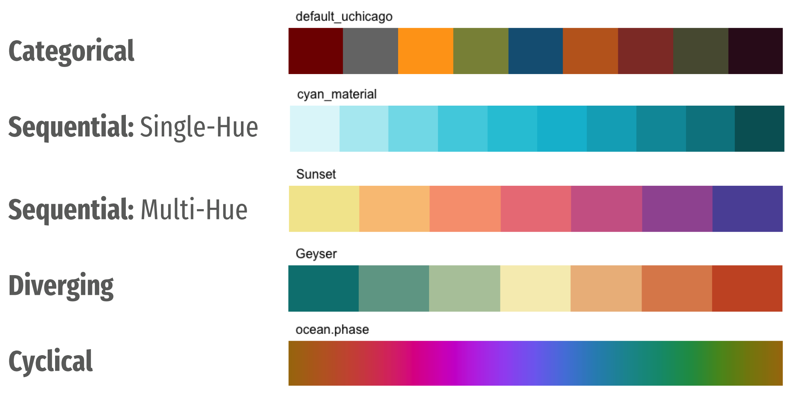
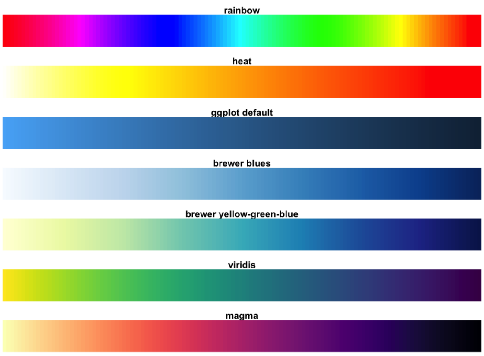
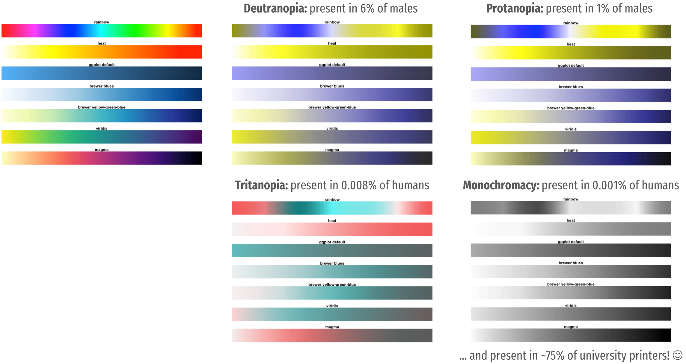
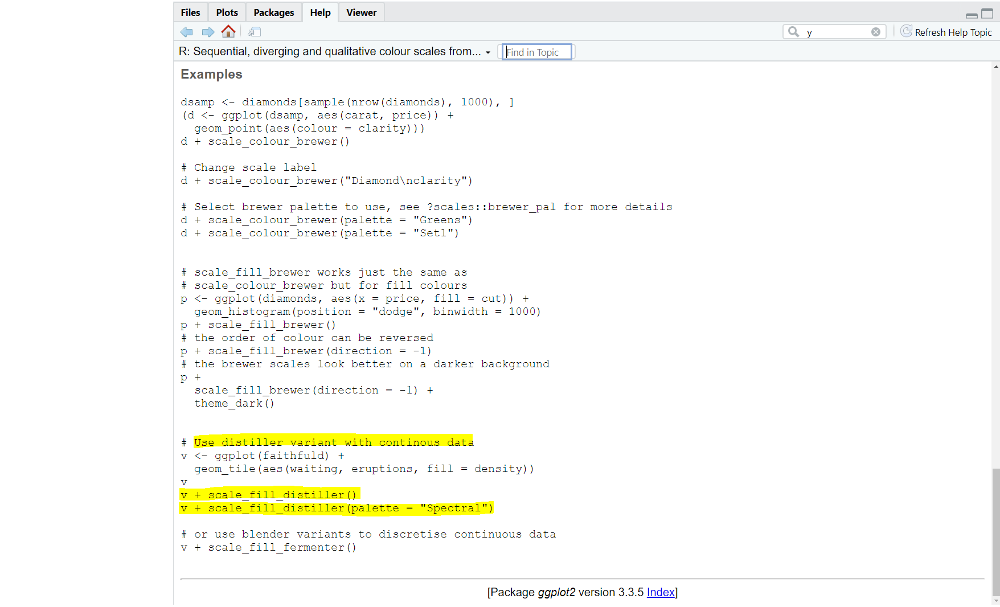
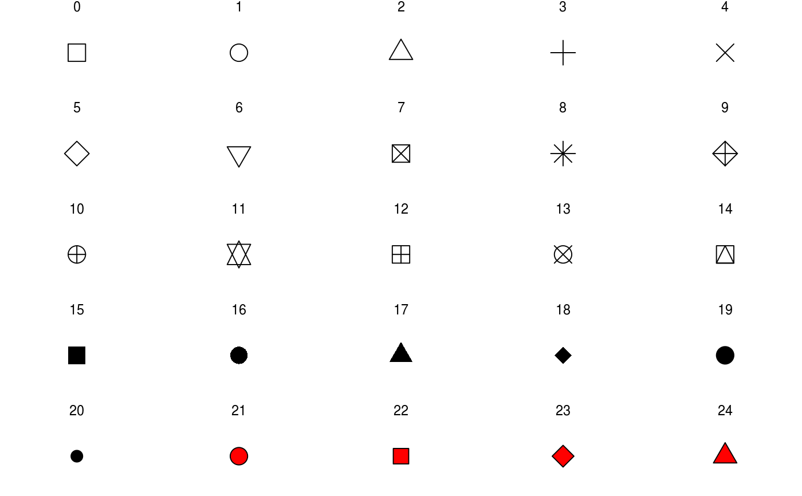

class: inverse, center
background-image: url("img/darklight_RichardStrozynski.jpg")
background-size: contain

```{r options, include = FALSE, purl=FALSE}
hook_source <- knitr::knit_hooks$get('source')
knitr::knit_hooks$set(source = function(x, options) {
  x <- stringr::str_replace(x, "^[[:blank:]]?([^*].+?)[[:blank:]]*#<<[[:blank:]]*$", "*\\1")
  hook_source(x, options)
})

knitr::opts_chunk$set(
  echo = TRUE, 
  warning = FALSE, 
  message = FALSE, 
  collapse = TRUE,
  fig.height = 6.3,
  fig.allign = 'center',
  fig.retina = 1,
  dev = "ragg_png", 
  res = 1000
)

Sys.setlocale("LC_TIME", "C")

options(width = 80)
```

<br><br>
# Hands–On Data Visualization with <code style='color:#ebc500;'>ggplot2</code><br><b style='font-size:25pt;color:#a7a7a7;'>Segment 3: Polish Your Visualization</b>
<br><br><br><br><br><br><br>
#### Dr. Cédric Scherer<b style='color:#ccba56;font-weight:400;line-height:150%;'><br>O'Reilly Live Training Session<br>September 3, 2021</b ><br>

```{r prep, echo=FALSE}
library(tidyverse)
library(conflicted)
filter <- dplyr::filter
theme_set(theme_light(base_size = 18, base_family = "Roboto Condensed"))
data <- readr::read_csv("https://raw.githubusercontent.com/z3tt/hands-on-ggplot2/main/data/crypto_cleaned.csv")
```

---
class: center, middle

<br><cap>Illustration by Allison Horst</cap>

---

## Adjust Colors and Other <code style='color:#28a87d;font-weight:700;'>aes</code>thetics

One can use `scale_*()` to change properties of all the **aesthetic dimensions mapped to the data**.

---

## Adjust Colors and Other <code style='color:#28a87d;font-weight:700;'>aes</code>thetics

One can use `scale_*()` to change properties of all the **aesthetic dimensions mapped to the data**.

<br>Consequently, there are `scale_*()` functions for all aesthetics such as:

* **positions** via `scale_x_*()` and `scale_y_*()`

* **colors** via `scale_color_*()` and `scale_fill_*()`

* **sizes** via `scale_size_*()` and `scale_radius_*()`

* **shapes** via `scale_shape_*()`  and `scale_linetype_*()`

* **transparency** via `scale_alpha_*()`

---

## Adjust Colors and Other <code style='color:#28a87d;font-weight:700;'>aes</code>thetics

One can use `scale_*()` to change properties of all the **aesthetic dimensions mapped to the data**

<br>The extensions (`*`) can be filled by e.g.:

* `continuous()`, `discrete()`, `reverse()`, `log10()`, `sqrt()`, `date()` for positions

* `continuous()`, `discrete()`, `manual()`, `gradient()`, `gradient2()`, `brewer()` for colors

* `continuous()`, `discrete()`, `manual()`, `ordinal()`, `area()`, `date()` for sizes

* `continuous()`, `discrete()`, `manual()`, `ordinal()` for shapes

* `continuous()`, `discrete()`, `manual()`, `ordinal()`, `date()` for transparency

---

## Scales: <code style='color:#28a87d;font-weight:700;'>scale\_\*()</code>

Scales are directly connected to aesthetics:

.pull-left[
```{r structure-scales, eval=FALSE}
ggplot(data, aes(x = date, y = close, 
                 color = currency)) +
  geom_line() +
  scale_x_date() +  #<<
  scale_y_continuous() +  #<<
  scale_color_discrete() #<<
```
]

.pull-right[
```{r plot-structure-scales, ref.label="structure-scales", echo=FALSE}
```
]

---

## Scales: <code style='color:#28a87d;font-weight:700;'>scale\_\*()</code>

All scales come with some general and specific arguments to change the appearance:

.pull-left[
```{r structure-scales-adj, eval=FALSE}
ggplot(data, aes(x = date, y = close, 
                 color = currency)) +
  geom_line() +
  scale_x_date(
    expand = c(0, 0), ## general #<<
    date_breaks = "4 months", ## date-only #<< 
    date_labels = "%m/%y", ## date only #<<
    name = NULL ## general  #<<
  ) +
  scale_y_continuous() +  
  scale_color_discrete() 
```
]

.pull-right[
```{r plot-structure-scales-adj, ref.label="structure-scales-adj", echo=FALSE}
```
]

---

## Scales: <code style='color:#28a87d;font-weight:700;'>scale\_\*()</code>

All scales come with some general and specific arguments to change the appearance:

.pull-left[
```{r structure-scales-adj2, eval=FALSE}
ggplot(data, aes(x = date, y = close, 
                 color = currency)) +
  geom_line() +
  scale_x_date(
    expand = c(0, 0), ## general
    date_breaks = "4 months", ## date-only  
    date_labels = "%m/%y", ## date only
    name = NULL ## general 
  ) +
  scale_y_continuous(
    labels = scales::dollar_format(), ## general  #<<
    sec.axis = dup_axis(name = NULL), ## axis only #<<
    name = "Closing Price" ## general  #<<
  ) + 
  scale_color_discrete()
```
]

.pull-right[
```{r plot-structure-scales-adj2, ref.label="structure-scales-adj2", echo=FALSE}
```
]

---

## Scales: <code style='color:#28a87d;font-weight:700;'>scale\_\*()</code>

All scales come with some general and specific arguments to change the appearance:

.pull-left[
```{r structure-scales-adj3, eval=FALSE}
ggplot(data, aes(x = date, y = close, 
                 color = currency)) +
  geom_line() +
  scale_x_date(
    expand = c(0, 0), ## general 
    date_breaks = "4 months", ## date-only 
    date_labels = "%m/%y", ## date only 
    name = NULL ## general 
  ) +
  scale_y_continuous(
    labels = scales::dollar_format(), ## general  
    sec.axis = dup_axis(name = NULL), ## axis only 
    name = "Closing Price" ## general 
  ) + 
  scale_color_discrete(
    type = c("#F0B90B", "#4d4d4e", #<<
             "#810080", "#00aeff"),  ## color only #<<
    name = "Cryptocurrency:" ## general  #<<
  )
```
]

.pull-right[
```{r plot-structure-scales-adj3, ref.label="structure-scales-adj3", echo=FALSE}
```
]

---
class: center, middle



---

## Scales: <code style='color:#28a87d;font-weight:700;'>scale\_color\_\*()</code>

All colors and fills that are mapped to **categorical** variables can be manipulated with either `scale_color|fill_discrete()` or `scale_color|fill_manual()`.

.pull-left[
```{r structure-scales-color-discrete, fig.height=3.5}
ggplot(data, aes(x = date, y = close, 
                 color = currency)) +
  geom_line() +
  scale_color_discrete( #<<
    type = c("#F0B90B", "#4d4d4e", #<<
             "#810080", "#00aeff") #<<
  ) #<<
```
]

.pull-right[
```{r structure-scales-color-manual, fig.height=3.5}
ggplot(data, aes(x = date, y = close, 
                 color = currency)) +
  geom_line() +
  scale_color_manual( #<<
    values = c("#F0B90B", "#4d4d4e", #<<
               "#810080", "#00aeff") #<<
  ) #<<
```
]

---

## Scales: <code style='color:#28a87d;font-weight:700;'>scale\_color\_\*()</code>

Here, you can overwrite the labels of your legend items—no need to manipulate the data itself!

.pull-left[
```{r structure-scales-color-manual-labels, eval=FALSE}
ggplot(data, aes(x = date, y = close, 
                 color = currency)) +
  geom_line() +
  scale_color_manual(
    values = c("#F0B90B", "#4d4d4e",
               "#810080", "#00aeff"),
    labels = c("Binance", "Bitcoin",  #<<
               "EOS", "Litecoin"), #<<
    name = "Cryptocurrency:" 
  )
```
]

.pull-right[
```{r plot-structure-scales-color-manual-labels, ref.label="structure-scales-color-manual-labels", echo=FALSE}
```
]

---
class: middle, center

<br><cap>{viridis} package reference</cap>

---
class: middle, center

<br><cap>Modified from the {viridis} package reference</cap>

---

## Scales: <code style='color:#28a87d;font-weight:700;'>scale\_color\_\*()</code>

There are a few and well crafted built-in palettes you can use as well (the defaults are pretty bad).

.pull-left[
```{r structure-scales-color-viridis-default, eval=FALSE}
ggplot(data, aes(x = date, y = close, 
                 color = currency)) +
  geom_line() +
  scale_color_viridis_d() #<<
```
]

.pull-right[
```{r plot-structure-scales-color-viridis-default, ref.label="structure-scales-color-viridis-default", echo=FALSE}
```
]

---
class: middle, center

<br><cap>{viridis} package reference</cap>

---

## Scales: <code style='color:#28a87d;font-weight:700;'>scale\_color\_\*()</code>

There are a few and well crafted built-in palettes you can use as well (the defaults are pretty bad).

.pull-left[
```{r structure-scales-color-viridis-turbo, eval=FALSE}
ggplot(data, aes(x = date, y = close, 
                 color = currency)) +
  geom_line() +
  scale_color_viridis_d(
    option = "turbo", #<<
    begin = .1, #<<
    end = .9, #<<
    name = "Cryptocurrency:" #<<
  )
```
]

.pull-right[
```{r plot-structure-scales-color-viridis-turbo, ref.label="structure-scales-color-viridis-turbo", echo=FALSE}
```
]

---

## Scales: <code style='color:#28a87d;font-weight:700;'>scale\_color\_\*()</code>

The viridis palettes are more suitable for continuous data:

.pull-left[
```{r structure-scales-color-viridis-cont, eval=FALSE}
ggplot(data, aes(x = date, y = close, 
                 color = yday, #<<
                 group = currency)) + #<<
  geom_line() +
  scale_color_viridis_c( #<<
    option = "turbo",
    begin = .1,
    end = .9, 
    name = "Julian Day:" #<<
  )
```
]

.pull-right[
```{r plot-structure-scales-color-viridis-cont, ref.label="structure-scales-color-viridis-cont", echo=FALSE}
```
]

---

## Scales: <code style='color:#28a87d;font-weight:700;'>scale\_color\_\*()</code>

The viridis palettes are more suitable for continuous data:

.pull-left[
```{r structure-scales-color-viridis-cont-rocket, eval=FALSE}
ggplot(data, aes(x = date, y = close, 
                 color = open, #<<
                 group = currency)) +
  geom_point() + #<<
  scale_color_viridis_c(
    option = "rocket", #<<
    direction = -1, #<<
    end = .9,
    labels = scales::dollar_format(), #<<
    name = "Julian Day:"
  )
```
]

.pull-right[
```{r plot-structure-scales-color-viridis-cont-rocket, ref.label="structure-scales-color-viridis-cont-rocket", echo=FALSE}
```
]

---

## Scales: <code style='color:#28a87d;font-weight:700;'>scale\_color\_\*()</code>

The viridis palettes are more suitable for continuous data:

.pull-left[
```{r structure-scales-color-breaks, eval=FALSE}
ggplot(data, aes(x = date, y = close, 
                 color = open, #<<
                 group = currency)) +
  geom_point() + #<<
  scale_color_viridis_c(
    option = "rocket",
    direction = -1, 
    end = .9,
    breaks = seq(50, 300, by = 100), #<<
    labels = scales::dollar_format(), 
    name = "Julian Day:"
  )
```
]

.pull-right[
```{r plot-structure-scales-color-breaks, ref.label="structure-scales-color-breaks", echo=FALSE}
```
]

---

## Scales: <code style='color:#28a87d;font-weight:700;'>scale\_color\_\*()</code>

Colorbrewer provides color schemes for maps.

```{r brewer-apls, fig.height=6.5}
RColorBrewer::display.brewer.all()
```

---

## Scales: <code style='color:#28a87d;font-weight:700;'>scale\_color\_\*()</code>

Colorbrewer provides color schemes for maps.

.pull-left[
```{r structure-scales-color-brewer-default, eval=FALSE}
ggplot(data, aes(x = date, y = close, 
                 color = currency)) +
    geom_line() +
    scale_color_brewer( #<<
        palette = "Set2", #<<
        name = "Cryptocurrency:" #<<
    ) #<<
```
]

.pull-right[
```{r plot-structure-scales-color-brewer-default, ref.label="structure-scales-color-brewer-default", echo=FALSE}
```
]

---
background-image: url("img/bg-exercise.png")
background-size: cover

## Exercise 1:

Colorbrewer provides color schemes for <u style='font-weight:600;'>maps</u>.

* Download the country data set from `{rnaturalearth}`.
  + see segment 2 if you don't remember how

* Visualize the economy classes (`economy`) as a choropleth map and use one of the<br>categorical colorbrewer palettes.

* Now change the code so the fill colors encode the estimated population (`pop_est`). 
  + What's the problem? How can you fix it?

---
background-image: url("img/bg-exercise.png")
background-size: cover

## Exercise 1:

Colorbrewer provides color schemes for <u style='font-weight:600;'>maps</u>.

* Download the country data set from `{rnaturalearth}`.
  + see segment 2 if you don't remember how

* Visualize the economy classes (`economy`) as a choropleth map and use one of the<br>categorical colorbrewer palettes.

* Now change the code so the fill colors encode the estimated population (`pop_est`). 
  + What's the problem? How can you fix it?<br><br>
  + Tip: Have a look at the note and examples on the help page: `?scale_fill_brewer`

---

## Exercise 1: Choropleth Map of Economy Classes

Colorbrewer provides color schemes for <u style='font-weight:600;'>maps</u>.

```{r map-brewer-disc, fig.width=16, fig.height=4.9}
sf_world <- rnaturalearth::ne_countries(returnclass = "sf")
ggplot(sf_world) +
  geom_sf(aes(fill = economy)) +
  scale_fill_brewer(palette = "Set2") + #<<
  coord_sf(crs = "+proj=moll")
```

---

## Exercise 1: Choropleth Map of Estimated Population

Colorbrewer provides color schemes for <u style='font-weight:600;'>maps</u>.

```{r map-brewer-cont-error, eval=FALSE}
ggplot(sf_world) +
  geom_sf(aes(fill = pop_est)) + #<<
  scale_fill_brewer(palette = "Set2") + 
  coord_sf(crs = "+proj=moll")
```
<br>
```{text}
Error: Continuous value supplied to discrete scale
```

---

## Exercise 1: Choropleth Map of Estimated Population

Colorbrewer provides color schemes for <u style='font-weight:600;'>maps</u>.

```{r map-brewer-cont-error2, eval=FALSE}
ggplot(sf_world) +
  geom_sf(aes(fill = pop_est)) +
  scale_fill_brewer(palette = "RdPu") + #<<
  coord_sf(crs = "+proj=moll")
```
<br>
```{text}
Error: Continuous value supplied to discrete scale
```

---

## Exercise 1: Choropleth Map of Estimated Population



---

## Exercise 1: Choropleth Map of Estimated Population

Colorbrewer provides color schemes for <u style='font-weight:600;'>maps</u>.

```{r map-brewer-cont, fig.width=16, fig.height=5.1}
ggplot(sf_world) +
  geom_sf(aes(fill = pop_est)) + 
  scale_fill_distiller(palette = "RdPu") + #<<
  coord_sf(crs = "+proj=moll")
```

---

## Exercise 1: Choropleth Map of Estimated Population

Colorbrewer provides color schemes for <u style='font-weight:600;'>maps</u>.

```{r map-brewer-cont-rev, fig.width=16, fig.height=5.1}
ggplot(sf_world) +
  geom_sf(aes(fill = pop_est)) + 
  scale_fill_distiller(palette = "RdPu", direction = 1) + #<<
  coord_sf(crs = "+proj=moll")
```

---

## Exercise 1: Choropleth Map of Estimated Population

Colorbrewer provides color schemes for <u style='font-weight:600;'>maps</u>.

```{r map-brewer-cont-rev-color, fig.width=16, fig.height=5.1}
ggplot(sf_world) +
  geom_sf(aes(fill = pop_est), color = NA) + #<<
  scale_fill_distiller(palette = "RdPu", direction = 1) + 
  coord_sf(crs = "+proj=moll")
```

---

## Scales: <code style='color:#28a87d;font-weight:700;'>scale\_fill\_gradient()</code>

You can also build your own **sequential color palettes**:

```{r map-gradient, fig.width=16, fig.height=5.1}
ggplot(sf_world) +
  geom_sf(aes(fill = pop_est), color = NA) + 
  scale_fill_gradient(low = "grey90", high = "firebrick4") + #<<
  coord_sf(crs = "+proj=moll")
```

---

## Scales: <code style='color:#28a87d;font-weight:700;'>scale\_fill\_gradient2()</code>

You can also build your own **diverging color palettes**:

```{r map-gradient-div, fig.width=16, fig.height=5.2}
ggplot(sf_world) +
  geom_sf(aes(fill = as.numeric(factor(income_grp))), color = NA) + #<<
  scale_fill_gradient2(low = "firebrick4", high = "darkcyan", mid = "grey90", name = "Income group:") + #<<
  coord_sf(crs = "+proj=moll")
```

---

## Scales: <code style='color:#28a87d;font-weight:700;'>scale\_fill\_gradient2()</code>

You can also build your own **diverging color palettes**:

```{r map-gradient-div-midpoint, fig.width=16, fig.height=4.9}
ggplot(sf_world) +
  geom_sf(aes(fill = as.numeric(factor(income_grp))), color = NA) +
  scale_fill_gradient2(low = "firebrick4", high = "darkcyan", mid = "grey90", name = "Income group:", 
                       midpoint = 3) + #<<
  coord_sf(crs = "+proj=moll")
```

---

## Color Palettes in <code style='color:#28a87d;font-weight:700;'>R</code>

<span style='font-size:18pt;'>Several packages offer predefined palettes, e.g.:</span>

* <span style='font-size:18pt;'>`{viridis}` for perceptually uniform palettes</span><br><br>
* <span style='font-size:18pt;'>`{scico}` for more perceptually uniform palettes</span><br><br>
* <span style='font-size:18pt;'>`{rcartocolor}` for map color palettes</span><br><br>
* <span style='font-size:18pt;'>`{ggsci}` for scientific journal and sci-fi themed color</span><br><br>
* <span style='font-size:18pt;'>`{ggthemes}` for colors of popular software & publishers</span><br><br>
* <span style='font-size:18pt;'>`{LaCroixColoR}` for vibrant summery colors</span><br><br>
<br>
<span style='font-size:18pt;'>Check the [collection by Emil Hvitfeldt](https://github.com/EmilHvitfeldt/r-color-palettes/blob/master/type-sorted-palettes.md) for an extensive list of color palettes available in `R`</span>

---

## A ggplot Object

By the way, you can store ggplots in objects and extend them later:

```{r map-store-object}
g <- ggplot(sf_world) + #<<
  geom_sf(aes(fill = as.numeric(factor(income_grp))), color = NA) +
  scale_fill_gradient2(low = "firebrick4", high = "darkcyan", mid = "grey90", name = "Income group:", 
                       midpoint = 3) +
  coord_sf(crs = "+proj=moll")

class(g) #<<
```

---

## Style Legends: <code style='color:#28a87d;font-weight:700;'>guides()</code>

The `guides()` function allows to adjust the appearance of each legend:

```{r guide-legend, fig.width=16, fig.height=5.6}
g +
  guides(fill = guide_legend(reverse = TRUE)) #<<
```

---

## Style Legends: <code style='color:#28a87d;font-weight:700;'>guides()</code>

The `guides()` function allows to adjust the appearance of each legend:

```{r guide-legend-height, fig.width=16, fig.height=5.6}
g +
  guides(fill = guide_legend(reverse = TRUE, keyheight = unit(2, "lines"))) #<<
```

---

## Style Legends: <code style='color:#28a87d;font-weight:700;'>guides()</code>

The `guides()` function allows to adjust the appearance of each legend:

```{r guide-colorbar-height-width, fig.width=16, fig.height=5.6}
g +
  guides(fill = guide_colorbar(barheight = unit(12, "lines"), #<<
                               barwidth = unit(1, "lines"))) #<<
```

---
background-image: url("img/bg-exercise.png")
background-size: cover

## Exercise 2:

* Create the following visualization with a viridis palette:
  
```{r exercise-plot, echo=FALSE, fig.width=12, fig.height=7, fig.align='center'}
ggplot(data, aes(close, open, color = high)) +
  geom_point(shape = 5, size = 4, stroke = 1.2) +
  scale_color_viridis_c(option = "mako", direction = -1, breaks = seq(50, 350, by = 50)) +
  guides(color = guide_colorsteps(barheight = unit(16, "lines")))
```

---

## Exercise 2: Create a Colored Scatterplot
  
```{r exercise-plot-solution-1, fig.width=16, fig.height=6}
ggplot(data, aes(close, open, color = high)) +
  geom_point(size = 4) +
  scale_color_viridis_c(option = "mako", direction = -1)
```

---
class: middle, center



---

## Exercise 2: Adjust Point Style
  
```{r exercise-plot-solution-2, fig.width=16, fig.height=5.7}
ggplot(data, aes(close, open, color = high)) +
  geom_point(shape = 5, size = 4, stroke = 1.2) + #<<
  scale_color_viridis_c(option = "mako", direction = -1)
```

---

## Exercise 2: Adjust Breaks
  
```{r exercise-plot-solution-3, fig.width=16, fig.height=5.7}
ggplot(data, aes(close, open, color = high)) +
  geom_point(shape = 5, size = 4, stroke = 1.2) +
  scale_color_viridis_c(option = "mako", direction = -1, breaks = seq(50, 350, by = 50)) #<<
```

---

## Exercise 2: Adjust Guide Type and Style
  
```{r exercise-plot-solution-4, fig.width=16, fig.height=5.4}
ggplot(data, aes(close, open, color = high)) +
  geom_point(shape = 5, size = 4, stroke = 1.2) +
  scale_color_viridis_c(option = "mako", direction = -1, breaks = seq(50, 350, by = 50)) +
  guides(color = guide_colorsteps(barheight = unit(16, "lines"))) #<<
```

---

## Style Legends: <code style='color:#28a87d;font-weight:700;'>theme()</code>

The position of the legend and some other properties can be changed via `theme()`

```{r guide-colorbar-theme, fig.width=16, fig.height=5.2}
g +
  guides(fill = guide_legend()) +
  theme(legend.position = "top", legend.key.height = unit(.5, "lines"), #<<
        legend.key.width = unit(4, "lines")) #<<
```

---

## Style Legends: <code style='color:#28a87d;font-weight:700;'>theme()</code>

You can change the position of the legend title and labels in `guides()`:

```{r guide-colorbar-theme-legendtitlepos, fig.width=16, fig.height=5.2}
g +
  guides(fill = guide_legend(title.position = "top", title.hjust = .5, label.position = "bottom")) + #<<
  theme(legend.position = "top", legend.key.height = unit(.5, "lines"),
        legend.key.width = unit(4, "lines")) 
```

---

## Themes: <b><code>theme_*()</code></b>

You have already seen built-in themes in segment 1:

```{r themes-1, echo=FALSE, fig.width=15, fig.height=7, fig.align="center"}
library(patchwork)

gg <- ggplot(data, aes(x = date, y = close, color = currency)) +
       geom_line(size = 1.5)

a <- gg +
  theme_grey() +
  ggtitle("theme_grey()  or  theme_gray()") 

b <- gg +
  theme_classic() +
  ggtitle("theme_classic()") 

c <- gg +
  theme_bw() +
  ggtitle("theme_bw()") 

d <- gg +
  theme_light() +
  ggtitle("theme_light()")

(a + b + c + d) * theme(plot.margin = margin(15, 30, 15, 30), plot.title = element_text(hjust = .5, face = "bold", size = 25))
```

---

## Themes: <b><code>theme_*()</code></b>

You have already seen built-in themes in segment 1:

```{r themes-2, echo=FALSE, fig.width=15, fig.height=7, fig.align="center"}
a <- gg +
  theme_minimal() +
  ggtitle("theme_minimal()") 

b <- gg +
  theme_dark() +
  ggtitle("theme_dark()") 

c <- gg +
  theme_linedraw() +
  ggtitle("theme_linedraw()")

d <- gg +
  theme_void() +
  ggtitle("theme_void()") 

(a + b + c + d) * theme(plot.margin = margin(15, 30, 15, 30), plot.title = element_text(hjust = .5, face = "bold", size = 25))
```

---

## Themes: <b><code>theme_*()</code></b>

You can either add theme changes to each plot or globally for all plots:

.pull-left[
```{r theme-local, fig.height=4}
ggplot(data, aes(x = date, y = close, color = currency)) +
  geom_line(size = 1.5) + 
  theme_classic(base_size = 16) #<<
```
]

.pull-left[
```{r theme-global, fig.height=4}
theme_set(theme_classic(base_size = 16)) #<<
ggplot(data, aes(x = date, y = close, color = currency)) +
  geom_line(size = 1.5)
```
]

---

```{r theme-function}
theme_grey
```

---

## <b><code>theme()</code> Arguments</b>

There are many elements you can customize. You can either group them by their type or by their category:

* element types: 

  - `text`&nbsp;&nbsp;&rarr;&nbsp;&nbsp; all labels, axis text, legend title and text
  - `line`&nbsp;&nbsp;&rarr;&nbsp;&nbsp; axis lines, ticks, grid lines
  - `rect`&nbsp;&nbsp;&rarr;&nbsp;&nbsp; plot area, panel area, legend and legend keys, facets

--

* element category:

  - `axis.*`&nbsp;&nbsp;&rarr;&nbsp;&nbsp; titles, text, ticks, lines
  - `legend.*`&nbsp;&nbsp;&rarr;&nbsp;&nbsp; background, margin, spacing, keys, text, title, position, direction, box
  - `panel.*`&nbsp;&nbsp;&rarr;&nbsp;&nbsp; background, border, margin, spacing, grid (major and minor)
  - `plot.*`&nbsp;&nbsp;&rarr;&nbsp;&nbsp; background, title, subtitle, caption, tag, margin
  - `strip.*`&nbsp;&nbsp;&rarr;&nbsp;&nbsp; background, placement, text

---

## Text Elements via `element_text()`

<p style='text-align:center;'></p>

---

## Text Elements via `element_text()`

```{r element-text}
my_text_element <- 
  element_text(
    family = "Roboto", ## you need {systemfonts} for this
    face = "bold", ## plain, italic, bolditalic
    size = 24,
    color = "firebrick",
    lineheight = .7,
    angle = 180,
    hjust = .5,
    vjust = .0,
    margin = margin(
      10, ## t (top)
      0,  ## r (right)
      30, ## b (bottom)
      0   ## l (left)
    )
  )
```

---

## Text Elements via `element_text()`

You can directly alter the appearance by adding `theme()` to a ggplot:

```{r element-text-example, fig.width=16, fig.height=5.7}
g +
  ggtitle("My New\nTitle") +
  theme(plot.title = my_text_element)
```

---

## Line Elements via `element_line()`

```{r element-line}
my_line_element <- 
  element_line(
    color = "black",
    size = 3,
    linetype = "dashed",
    lineend = "square", # round, butt
    arrow = arrow(
      angle = 30, 
      length = unit(0.25, "inches")
    )
  )
```

---

## Line Elements via `element_line()`

You can directly alter the appearance by adding `theme()` to a ggplot:

```{r element-line-example, fig.width=16, fig.height=5.7}
g +
  theme(panel.grid = my_line_element)
```

---
background-image: url("img/bg-exercise.png")
background-size: cover

## Exercise 3:

* Have a closer look at the code of `theme_grey` and of the other themes. What's the difference? 

* Create a theme that is as ugly as possible!<br><br><u>or:</u><br>

* Create a theme that you can use ass personal theme.

* Apply it to a plot.

---

## Exercise 3: <code style='color:#28a87d;font-weight:700;'>theme_grey|gray()</code

```{r theme-grey}
theme_grey
```

---

## Exercise 3: <code style='color:#28a87d;font-weight:700;'>theme_bw()</code>

```{r theme-bw}
theme_bw
```

---

## Exercise 3: Create Your Own Theme!

```{r theme-ugly}
theme_ugly <-
  function(base_size = 14, ...) {
    theme_dark(base_size = base_size) %+replace% 
        theme(
          text = element_text(color = "coral1", family = "Sniglet", size = base_size),
          axis.text = element_text(color = "grey80", size = rel(.7)),
          axis.ticks = element_line(color = "grey90"),
          plot.title = element_text(
            family = "Bigfish Black",
            color = "red", size = rel(1.5), lineheight = 1.2,
            margin = margin(base_size, 0, base_size * 2, 0)
          ),
          plot.title.position = "plot",
          panel.grid = element_line(color = "red", linetype = "4127"),
          plot.background = element_rect(fill = "grey10", color = "red", size = 5),
          plot.margin = margin(rep(25, 4)),
          legend.background = element_rect(fill = "black", color = "red", size = 2), 
          complete = TRUE
        )
}
```

---

```{r theme-ugly-apply-plot, echo=FALSE, fig.width=13, fig.height=8, fig.align='center'}
library(ragg)

register_variant(
    name = "Bigfish Black",
    family = "Bigfish",
    weight = "heavy"
)

ggplot(data, aes(x = date, y = close, color = high)) +
  geom_point() +
  scale_x_date(expand = c(0, 0), date_breaks = "4 months", date_labels = "%m/%Y") +
  scale_y_continuous(labels = scales::dollar_format(), 
                     sec.axis = dup_axis(name = NULL)) + 
  scale_color_viridis_c(option = "turbo", breaks = seq(50, 350, by = 50), 
                        labels = scales::dollar_format(), name = "Highest Price") +
  guides(color = guide_colorsteps(barheight = unit(15, "lines"))) +
  coord_polar() +
  ggtitle("I went to Cédric's ggplot2 course and\nall I got is this ridiculous chart") +
  theme_ugly(base_size = 20)
```

---

## Exercise 3: Apply Your Own Theme!

```{r theme-ugly-apply, eval=FALSE}
ggplot(data, aes(x = date, y = close, color = high)) +
  geom_point() +
  scale_x_date(expand = c(0, 0), date_breaks = "4 months", date_labels = "%m/%Y") +
  scale_y_continuous(labels = scales::dollar_format(), 
                     sec.axis = dup_axis(name = NULL)) + 
  scale_color_viridis_c(option = "turbo", breaks = seq(50, 350, by = 50), 
                        labels = scales::dollar_format(), name = "Highest Price") +
  guides(color = guide_colorsteps(barheight = unit(15, "lines"))) +
  coord_polar() +
  ggtitle("I went to Cédric's ggplot2 course and\nall I got is this ridiculous chart") +
  theme_ugly(base_size = 20)
```

---

## Resources

* [Modify theme components](https://ggplot2.tidyverse.org/reference/theme.html) on the ggplot reference page

* Chapter 19 [Themes](https://ggplot2-book.org/polishing.html) of the “ggplot2” book by Hadley Wickham et al.

* [“Creating and Using Custom ggplot2 Themes”](https://themockup.blog/posts/2020-12-26-creating-and-using-custom-ggplot2-themes/) and [“Add a Logo to Your Plot”](https://themockup.blog/posts/2019-01-09-add-a-logo-to-your-plot/), blog posts by Thomas Mock

* [“How to Add a Logo to ggplot by Magick”](https://www.danielphadley.com/ggplot-logo/), blog post by Daniel Hadley

* [“Themes to Improve Your ggplot Figures”](https://rfortherestofus.com/2019/08/themes-to-improve-your-ggplot-figures/) from [R for the Rest of Us](https://rfortherestofus.com/) with a collection of additional themes

* [“A `{ggplot2}` Tutorial for Beautiful Plotting in R”](https://www.cedricscherer.com/2019/08/05/a-ggplot2-tutorial-for-beautiful-plotting-in-r/), my extensive "how to"-tutorial
